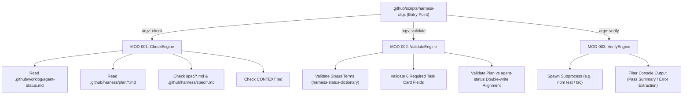

# 架構設計文件 (SA/SD): Harness 程式化檢查 CLI 工具 (`harness-cli.js`)

- **版本**：v0.1.0
- **日期**：2026-08-13
- **參照規格**：.github/harness/spec/harness-cli-automation-spec.md
- **檔案位置**：.github/harness/design/harness-cli-automation-design.md

---

## 1. 系統分析 (System Analysis - SA)

### 1.1 模組架構圖 (System Architecture)



### 1.2 模組劃分 (Module Components)

| 模組 ID | 模組名稱 | 權責與職責 |
| --- | --- | --- |
| **MOD-001** | `CheckEngine` | 負責無死角掃描現有活文件，判定 4 啟動閘門狀態，並輸出 JSON 狀態給 Agent |
| **MOD-002** | `ValidateEngine` | 靜態解析 Markdown 內容，比對狀態字典與 Task Card 六大欄位完整性 |
| **MOD-003** | `VerifyEngine` | 包裝命令執行，將極長無效的主機 Console Log 壓縮成可讀性極高的短訊息 |

---

## 2. 系統設計 (System Design - SD)

### 2.1 API / CLI 命令設計 (CLI Subcommands)

#### 1. `node .github/scripts/harness-cli.js check`
* **輸入**：無（自動讀取 workspace 的活文件）
* **輸出** (stdout)：JSON 格式
  ```json
  {
    "active_task": "TASK-HARNESS-CLI-SPEC",
    "status": "in_progress",
    "has_spec": true,
    "has_context": false,
    "gate_action": "PASS",
    "recommended_skill": "analyze-spec"
  }
  ```
* **Exit Code**：0

#### 2. `node .github/scripts/harness-cli.js validate`
* **輸入**：可選包含 `--file <path>`，預設校驗 `agent-status.md` 與最新 `build-plan.md`
* **輸出** (stdout)：
  * 成功：`✅ Validation Passed: All task cards & status terms are compliant.`
  * 失敗：`❌ Validation Failed (Exit 1):\n  - agent-status.md: Missing required Task Card field '驗證證據'`
* **Exit Code**：0 (Success) 或 1 (Validation Error)

#### 3. `node .github/scripts/harness-cli.js verify -- <command>`
* **範例**：`node .github/scripts/harness-cli.js verify -- npm test`
* **輸出** (stdout)：
  * 成功：`✅ [VERIFY PASSED] Command 'npm test' completed cleanly (0 errors).`
  * 失敗：`❌ [VERIFY FAILED] Command 'npm test' exited with code 1:\n--- Error Summary ---\n...`
* **Exit Code**：透傳被包裝命令的 Exit Code。

---

### 2.2 測試策略 (Test Plan)

- **單元測試套件**：`.github/scripts/harness-cli.test.js`
- **測試範疇**：
  1. `check` 傳回預期 JSON。
  2. `validate` 對正常與損毀的 Task Card Markdown 能精準開出 0 或 1 離開碼。
  3. `verify` 成功包裝 Echo 與失敗 Command。
