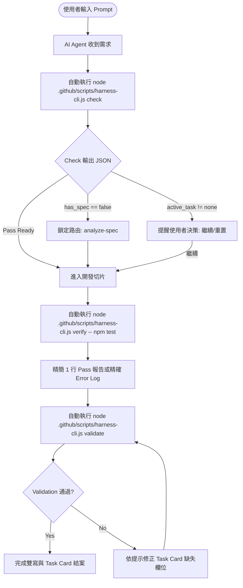

# Feature Spec: Harness 程式化檢查與 Token 優化 CLI 工具 (`harness-cli.js`)

- **版本**：v0.1.0
- **日期**：2026-08-13
- **狀態**：已簽核 (Approved)
- **領域**：Harness Workflow / AI Agent Token Optimization
- **檔案位置**：.github/harness/spec/harness-cli-automation-spec.md

---

## 1. 摘要 (Summary)

本功能為 `plan-to-build` Harness Workflow 提供一套零外加大型依賴、輕量且高效的 Node.js 程式化檢查與工具集 (`.github/scripts/harness-cli.js`)。旨在替代傳統 AI Agent 需要漫長閱覽大型 Markdown 規範文件與活文件（如 `AGENTS.md`、`agent-status.md`、`*-build-plan.md`）並耗費大量 Context Window/Tokens 進行手動推理與比對的模式。

通過暴露 `check`、`validate` 與 `verify` 三大 CLI 子命令，使 AI Agent 能在 0.1 秒內完成 4 啟動閘門評估、 Task Card 完整性校驗與驗證 Log 濃縮，大幅提升代理效率並降低 Token 消耗。

---

## 2. 目標 (Goals) & 非目標 (Non-goals)

### 目標 (Goals)
1. **REQ-F001 [🔴 必要] Pre-flight Gate Check (`check`)**：
   - 掃描 `.github/worklog/agent-status.md` 與 `.github/harness/plan/*.md`，檢驗是否存在未完成任務。
   - 檢查專案是否缺少 `spec/{feature}-spec.md` 或 `.github/harness/spec/{feature}-spec.md`，若缺則回傳強制導向 `analyze-spec` 路由提示。
   - 檢查專案是否缺少 `CONTEXT.md`。
   - 輸出極簡 JSON（< 10 行），包含 active_task、has_spec、gate_action、recommended_skill。
2. **REQ-F002 [🔴 必要] Task Card & Status Validator (`validate`)**：
   - 解析 Markdown 活文件，驗證狀態字詞是否符合 `.github/harness/harness-status-dictionary.md` 規範（`未開始`, `進行中`, `已完成`, `阻塞`, `暫停`, `需補充輸入`, `已重置`）。
   - 驗證標記為 `已完成` 之 Task Card 是否補齊六大必填欄位（`目標`, `範圍`, `驗收標準`, `更新檔案`, `驗證證據`, `阻塞/恢復入口`）。
   - 驗證 Build Plan 最新切片與 `agent-status.md` 的 `CurrentStep` 是否一致。
3. **REQ-F003 [🔴 必要] Log Summarizer & Verification Wrapper (`verify`)**：
   - 執行指定測試或建置命令（如 `npm test` 或 `npm run lint`）。
   - 成功時過濾重複印出的檔名與過度細節，僅輸出單行通過摘要。
   - 失敗時僅擷取關鍵 Error Message、Failed Assertions 與失敗程式碼行號，剔除過長的 node_modules 追蹤資訊。
4. **REQ-F004 [🔴 必要] npm scripts & Agent Workflow 整合**：
   - 在 `package.json` 中配置 `harness:check`、`harness:validate` 與 `harness:verify` 快捷鍵。
   - 更新 `AGENTS.md` 與 `.github/harness/harness-workflow.md` 引導指引。
5. **REQ-NF001 [🔴 必要] 零外加依賴與高效能**：
   - 完全採用 Node.js 原生模組 (`fs`, `path`, `child_process`) 撰寫，零 npm 安裝負擔，啟動速度 < 200ms。

### 非目標 (Non-goals)
- 不開發 GUI / Web 前端 Dashboard。
- 不串接遠端 LLM API 或第三方計費/分析平台。
- 不破壞或修改原有 `harness-status-dictionary.md` 的狀態枚舉定義。

---

## 3. 核心使用者與系統流程 (Happy Path Flow)

---

## 4. 詳細功能性需求 (Functional Requirements)

| 需求 ID | 項目名稱 | 優先序 | 描述 | 驗收標準 |
| --- | --- | --- | --- | --- |
| REQ-F001 | CLI `check` 子命令 | 🔴 必要 | 執行預檢與 4 啟動閘門掃描 | 執行 `node .github/scripts/harness-cli.js check` 可於 stdout 輸出合法 JSON 格式，且能精準識別 active_task 狀態與是否有 spec 檔 |
| REQ-F002 | CLI `validate` 子命令 | 🔴 必要 | 靜態驗證 agent-status 與 plan Markdown Schema | 檢驗狀態字詞合規性與 6 大欄位完整性；若缺欄位回傳非零 Exit Code 並印出錯誤行號 |
| REQ-F003 | CLI `verify` 子命令 | 🔴 必要 | 過濾測試/建置 console output | 執行 `node .github/scripts/harness-cli.js verify -- <command>` 能正確抓取子行程輸出並壓縮日誌 |
| REQ-F004 | 單元測試套件 | 🔴 必要 | 驗證 CLI 各項模組邏輯 | 撰寫 `.github/scripts/harness-cli.test.js`，包含 happy path 與 edge cases (損毀的 Markdown, 缺失欄位) |
| REQ-F005 | Harness 規範文件更新 | 🔴 必要 | 引導 Agent 自動調用 | 在 `AGENTS.md` 與 `harness-workflow.md` 中補充說明 Agent 應優先調用 `harness-cli` |

---

## 5. 非功能性需求 (Non-Functional Requirements)

- **REQ-NF001 [效能]**：`check` 與 `validate` 指令應在 200 毫秒內執行完畢。
- **REQ-NF002 [相容性]**：支援 Mac (macOS) 與 Linux 環境下的 Node.js >= 18。
- **REQ-NF003 [安全性]**：`verify` 子命令只允許執行傳入的命令，不得注入任意非受控 shell 指令。

---

## 6. 風險、邊界與限制 (Risks & Edge Cases)

1. **Markdown 格式寫法多變**：
   - *風　險*：活文件中的 Markdown 標題（如 `#`, `##`, `###`）或表格格式若有細微差異，Regex 可能解析失敗。
   - *對　策*：採用寬容度高的 Markdown Key-Value 解析法，並適度比對區塊標題而非死板的固定行號。
2. **命令執行錯誤 (Exit Code)**：
   - *風　險*：`verify` 子命令包裝的子行程若崩潰，Exit Code 必須原汁原味透傳給父行程。
   - *對　策*：在 `child_process.spawnSync` 或 `execSync` 中明確補捉與透傳 `exitCode`。

---

## 7. 版本修訂記錄 (Revision History)

- **v0.1.0** (2026-08-13)：初版 Spec 完成與簽核落檔。
