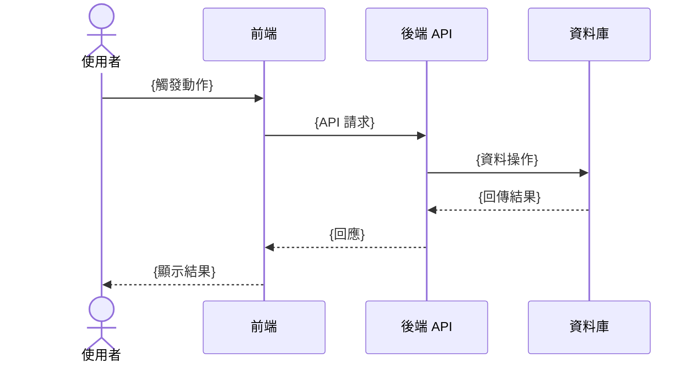

# 規格書範本

> 使用說明：複製此範本，填寫各欄位。`[待確認]` 標記代表需要與相關人員確認的項目。

---

# {專案名稱} 規格書

**版本**：v0.1  
**建立日期**：{YYYY-MM-DD}  
**最後更新**：{YYYY-MM-DD}  
**作者**：{作者}  
**狀態**：草稿 / 審核中 / 已確認

---

## 1. 利害關係人地圖（Stakeholders）

> 確認每個角色在規格書確認流程中的職責。決策者必須在「已確認」狀態前完成核可。

| 姓名/角色 | 單位/職稱 | 角色 | 聯絡方式 |
| --------- | --------- | ---- | -------- |
| {姓名} | {職稱} | 決策者（Decider） | {email/Slack} |
| {姓名} | {職稱} | 諮詢者（Consulted） | {email/Slack} |
| {姓名} | {職稱} | 知情者（Informed） | {email/Slack} |

**核可協議：**  
此規格書需由以上**決策者**確認後，狀態方可更新為「已確認」。決策者的核可代表對 Goals、Non-goals 與需求優先序（🔴）的認可。

---

## 2. 專案概述（Executive Summary）

> 用 2-3 句話描述這個專案是什麼、為誰而建、解決什麼問題。

{專案概述內容}

---

## 3. 背景與動機（Background & Motivation）

> 描述為什麼需要這個專案？現況痛點是什麼？不做的話會有什麼影響？

**現況問題：**
{描述現有問題或痛點}

**機會或驅動力：**
{描述市場機會、業務需求或技術債}

---

## 4. 目標與非目標（Goals & Non-goals）

### 目標（Goals）

> 這個版本要達成什麼？可衡量的成功指標是什麼？

- [ ] {目標 1}
- [ ] {目標 2}

### 非目標（Non-goals）

> 明確排除在本次範疇之外的項目，避免範疇蔓延。

- {非目標 1}（原因：{原因}）
- {非目標 2}

---

## 5. 使用者與情境（Users & Use Cases）

### 目標使用者

| 角色     | 描述   | 主要需求 |
| -------- | ------ | -------- |
| {角色 1} | {描述} | {需求}   |
| {角色 2} | {描述} | {需求}   |

### 使用情境（Use Cases）

**UC-001：{情境名稱}**

- **角色**：{使用者角色}
- **前置條件**：{前置條件}
- **主要流程**：
  1. {步驟 1}
  2. {步驟 2}
- **預期結果**：{結果}
- **例外情況**：{例外處理}

---

## 6. 功能流程圖（Functional Flowcharts）

> 為每個複雜度中以上的 Use Case 繪製流程圖。使用 Mermaid 語法，正常路徑用實線，錯誤路徑用虛線。

### FLOW-001：{對應 UC 名稱} 主流程

```mermaid
flowchart TD
    A([開始]) --> B[{觸發動作}]
    B --> C{條件判斷}
    C -- 是 --> D[{處理步驟}]
    C -- 否 --> E[{替代處理}]
    D --> F{驗證結果}
    F -- 成功 --> G[{成功動作}]
    F -- 失敗 --> H[顯示錯誤訊息]
    H -.-> B
    G --> Z([結束])
    E --> Z
```

### FLOW-002：{對應 UC 名稱} 多角色互動流程（如適用）



---

## 7. 功能需求（Functional Requirements）

> 優先序：🔴 必要（Must have）/ 🟡 應有（Should have）/ 🟢 可有（Nice to have）

| ID       | 需求描述       | 優先序 | 相依     | 備註     |
| -------- | -------------- | ------ | -------- | -------- |
| REQ-F001 | {功能需求描述} | 🔴     | -        |          |
| REQ-F002 | {功能需求描述} | 🟡     | REQ-F001 |          |
| REQ-F003 | {功能需求描述} | 🟢     | -        | [待確認] |

### 需求詳述

#### REQ-F001：{需求名稱}

**描述**：{詳細描述}

**驗收標準**（Acceptance Criteria）：

- [ ] {標準 1}
- [ ] {標準 2}

---

## 8. 非功能需求（Non-functional Requirements）

| ID        | 類型     | 需求描述     | 指標          | 優先序 |
| --------- | -------- | ------------ | ------------- | ------ |
| REQ-NF001 | 效能     | 頁面載入時間 | < 2 秒（P95） | 🔴     |
| REQ-NF002 | 安全性   | 使用者驗證   | JWT + HTTPS   | 🔴     |
| REQ-NF003 | 可用性   | 系統可用率   | 99.9% SLA     | 🟡     |
| REQ-NF004 | 可擴展性 | {描述}       | {指標}        | 🟢     |

---

## 9. 技術考量（Technical Considerations）

### 技術棧建議

| 層次   | 技術選項 | 建議   | 理由   |
| ------ | -------- | ------ | ------ |
| 前端   | {選項}   | {建議} | {理由} |
| 後端   | {選項}   | {建議} | {理由} |
| 資料庫 | {選項}   | {建議} | {理由} |
| 部署   | {選項}   | {建議} | {理由} |

### 整合與相依

- **外部系統**：{需整合的外部 API 或服務}
- **內部相依**：{依賴的內部服務或資料}
- **資料遷移**：{是否需要資料遷移，影響範圍}

### 技術限制

- {限制 1}
- {限制 2}

---

## 10. 里程碑規劃（Milestones）

| 里程碑        | 目標           | 包含功能            | 預計完成 |
| ------------- | -------------- | ------------------- | -------- |
| M0 - 專案啟動 | 環境建置完成   | 開發環境、CI/CD     | {日期}   |
| M1 - MVP      | 核心功能可運作 | REQ-F001, REQ-F002  | {日期}   |
| M2 - Beta     | 完整功能       | 全部 Must have      | {日期}   |
| M3 - Launch   | 正式上線       | 所有功能 + 效能優化 | {日期}   |

---

## 11. 風險與假設（Risks & Assumptions）

### 假設

- {假設 1}：{說明}
- {假設 2}：{說明}

### 風險

| 風險描述 | 影響     | 可能性   | 緩解策略 |
| -------- | -------- | -------- | -------- |
| {風險 1} | 高/中/低 | 高/中/低 | {策略}   |
| {風險 2} | 高/中/低 | 高/中/低 | {策略}   |

---

## 12. 開放性問題（Open Questions）

> 尚未決定或需要進一步討論的問題。

> 尚未決定或需要進一步討論的問題。

| #   | 問題       | 負責人   | 期限   | 狀態      |
| --- | ---------- | -------- | ------ | --------- |
| Q1  | {問題描述} | {負責人} | {日期} | 🔍 待討論 |
| Q2  | {問題描述} | {負責人} | {日期} | ✅ 已解決 |

---

## 13. 需求衝突決策記錄（Conflict Resolution Log）

> 當不同利害關係人的需求發生衝突時，記錄決策過程與理由。此記錄一旦建立不得靜默刪除。

| #   | 衝突描述 | 選項 A | 選項 B | 決策結果 | 決策者 | 決策日期 | 理由 |
| --- | -------- | ------ | ------ | -------- | ------ | -------- | ---- |
| C1  | {衝突描述} | {選項 A} | {選項 B} | {結果} | {決策者} | {日期} | {理由} |

---

## 附錄

### 相關文件

- {文件名稱}：{連結或說明}

### 修訂記錄

| 版本 | 日期   | 修改人 | 變更說明 |
| ---- | ------ | ------ | -------- |
| v0.1 | {日期} | {作者} | 初稿建立 |
