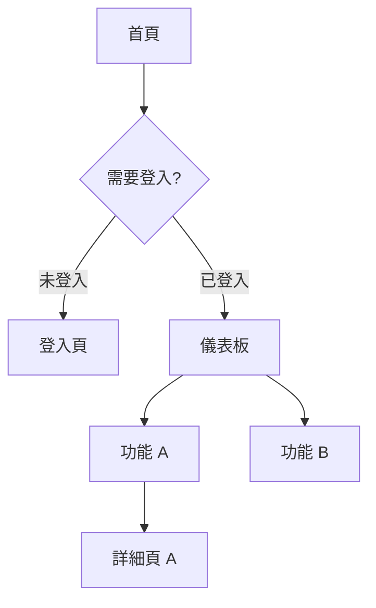

# 繪製 Sitemap、產出 SA 與 SD 文件

## 使用時機

- 需求規格書（Spec）已確認，準備進入設計階段
- 需要確立頁面結構與使用者動線（Sitemap）
- 需要切分功能模組、定義邊界與資料流（SA）
- 需要確立技術實作方案、資料庫結構與 API 設計（SD）

## 輸入來源

優先讀取 `docs/spec/` 下最新的規格書。若使用者直接提供需求摘要，亦可以此為基礎進行設計。

---

## 流程步驟

### 第一階段：解析規格書

1. 讀取規格書（或使用者提供的需求摘要）
2. 提取以下關鍵資訊：
   - 使用者角色（Roles）
   - 功能需求清單（REQ-F 系列）
   - 使用情境（Use Cases）
   - 技術限制與選型
3. 確認是否有未決的 `[待確認]` 項目，若有則先提醒使用者

### 第二階段：繪製 Sitemap

參考 [Sitemap 規範](./references/sitemap-guide.md)，以 Mermaid 圖表呈現頁面結構：

1. 識別所有頁面與畫面（依使用者角色分組）
2. 繪製頁面導覽流程（Navigation Flow）
3. 標記需要驗證/權限的頁面
4. 產出 Mermaid `graph TD` 格式的 Sitemap

**輸出格式範例：**

### 第三階段：產出 SA（系統分析）文件

讀取 [SA 範本](./assets/sa-template.md)，填入以下內容：

1. **系統架構圖**：前端 / 後端 / 資料層的分層架構（Mermaid `graph LR`）
2. **功能模組切分**：識別主要模組，定義各模組的職責與邊界
3. **使用者流程圖**：每個核心 Use Case 的 Sequence Diagram（Mermaid `sequenceDiagram`）
4. **資料模型概觀**：主要實體（Entity）及其關聯（Mermaid `erDiagram`）
5. **模組相依圖**：各模組間的呼叫關係

### 第四階段：產出 SD（系統設計）文件

讀取 [SD 範本](./assets/sd-template.md)，填入以下內容：

1. **技術棧確認**：確認各層的技術選型與版本
2. **資料庫 Schema 設計**：詳細的資料表結構（欄位、型別、索引、關聯）
3. **API 設計**：每支 API 的路由、方法、Request / Response Schema
4. **元件設計**（前端）：主要元件樹結構、Props 定義、狀態管理方案
5. **部署架構**：環境規劃（dev / staging / prod）、CI/CD 流程
6. **安全性設計**：驗證機制、授權策略、敏感資料處理方式

### 第五階段：寫入文件

將三份文件分別寫入專案：

| 文件    | 路徑                                  |
| ------- | ------------------------------------- |
| Sitemap | `docs/design/sitemap-{YYYY-MM-DD}.md` |
| SA 文件 | `docs/design/sa-{YYYY-MM-DD}.md`      |
| SD 文件 | `docs/design/sd-{YYYY-MM-DD}.md`      |

- 若 `docs/design/` 目錄不存在，先建立再寫入
- 確認三份文件均成功建立後，逐一回報路徑
- **文件必須實際寫入檔案，不可只在對話中顯示內容**

### 第六階段：摘要與下一步

1. 條列三份文件的重點摘要
2. 標記 `[待確認]` 項目（如技術選型未定、資料表欄位待討論）
3. 建議下一步：任務拆解與工作估點

---

## 輸出規範

### Sitemap

- 使用 Mermaid `graph TD` 語法
- 以角色為分組依據，標示權限邊界

### SA 文件

- 所有圖表使用 Mermaid 語法（`graph`、`sequenceDiagram`、`erDiagram`）
- 每個模組需有模組 ID（格式：`MOD-001`）
- 每個 Use Case 流程需對應規格書的 UC 編號

### SD 文件

- API 一律以表格呈現（Method、路由、描述、Request、Response）
- 資料庫 Schema 同時提供 ER 圖與詳細欄位定義表格
- 技術選型需標明版本號

---

## 參考資源

- [Sitemap 繪製規範](./references/sitemap-guide.md)
- [SA 文件範本](./assets/sa-template.md)
- [SD 文件範本](./assets/sd-template.md)
