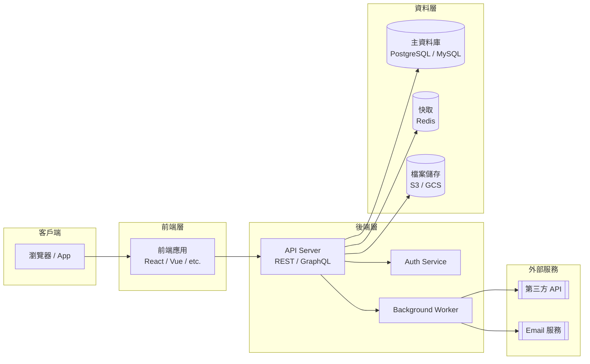
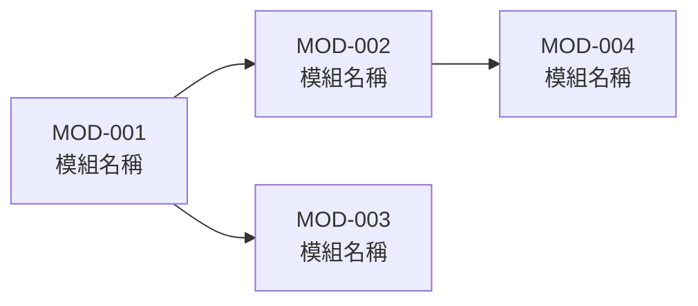
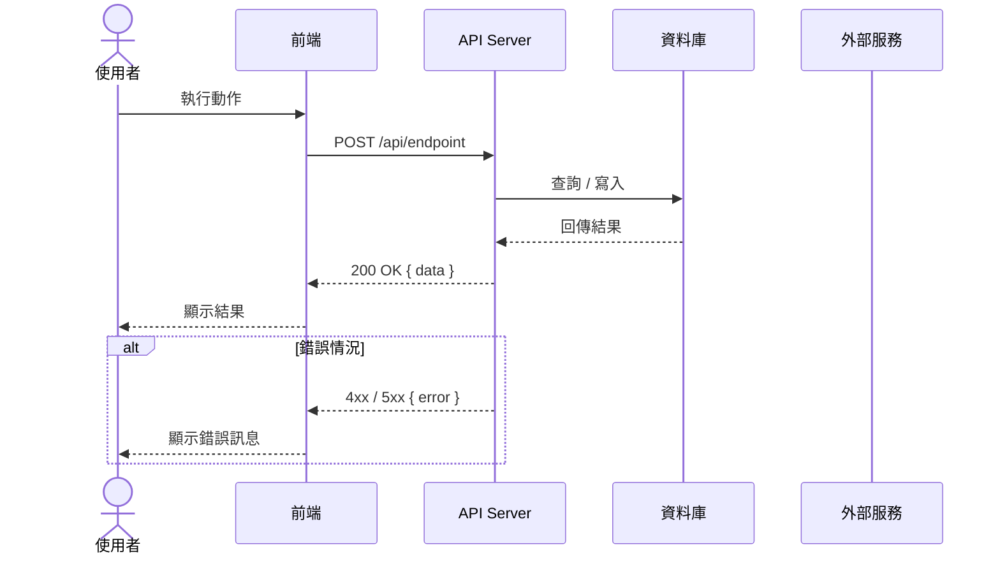
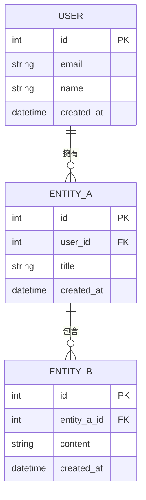

# {專案名稱} 系統分析文件（SA）

**版本**：v0.1  
**建立日期**：{YYYY-MM-DD}  
**最後更新**：{YYYY-MM-DD}  
**對應規格書**：`docs/spec/{project-name}-spec-{YYYY-MM-DD}.md`  
**狀態**：草稿 / 審核中 / 已確認

---

## 1. 系統架構概觀

### 1.1 架構圖

### 1.2 架構說明

| 層次       | 技術選型 | 職責   |
| ---------- | -------- | ------ |
| 前端       | {技術}   | {職責} |
| API Server | {技術}   | {職責} |
| 資料庫     | {技術}   | {職責} |
| 快取       | {技術}   | {職責} |

---

## 2. 功能模組切分

### 2.1 模組清單

| 模組 ID | 模組名稱 | 職責描述 | 對應 REQ           | 相依模組 |
| ------- | -------- | -------- | ------------------ | -------- |
| MOD-001 | {模組名} | {職責}   | REQ-F001           | -        |
| MOD-002 | {模組名} | {職責}   | REQ-F002, REQ-F003 | MOD-001  |

### 2.2 模組相依圖

### 2.3 各模組詳述

#### MOD-001：{模組名稱}

**職責**：{詳細描述模組的功能邊界}

**提供的介面**：

- `{方法/函式}(參數)`：{說明}

**消費的介面**：

- 依賴 {MOD-XXX} 的 `{方法/函式}`

**對應頁面**：PAGE-001, PAGE-002

---

## 3. 使用者流程圖（Use Case Sequence Diagrams）

### UC-001：{情境名稱}

> 對應規格書 UC-001

---

## 4. 資料模型概觀（Entity Relationship）

### 主要實體說明

| 實體     | 說明   | 關聯                         |
| -------- | ------ | ---------------------------- |
| USER     | {說明} | 擁有多個 ENTITY_A            |
| ENTITY_A | {說明} | 屬於 USER，包含多個 ENTITY_B |
| ENTITY_B | {說明} | 屬於 ENTITY_A                |

---

## 5. 頁面與模組對應

| 頁面 ID  | 頁面名稱 | 涉及模組         | 主要操作   |
| -------- | -------- | ---------------- | ---------- |
| PAGE-001 | {頁面名} | MOD-001          | 讀取、列表 |
| PAGE-002 | {頁面名} | MOD-001, MOD-002 | 新增、編輯 |

---

## 6. 開放性問題

| #   | 問題   | 影響模組 | 負責人   | 狀態      |
| --- | ------ | -------- | -------- | --------- |
| Q1  | {問題} | MOD-001  | {負責人} | 🔍 待確認 |

---

## 修訂記錄

| 版本 | 日期   | 修改人 | 變更說明 |
| ---- | ------ | ------ | -------- |
| v0.1 | {日期} | {作者} | 初稿建立 |
