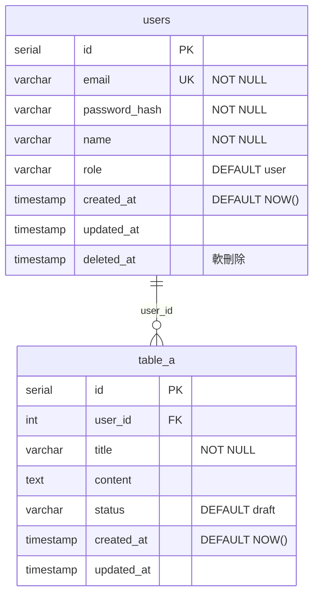
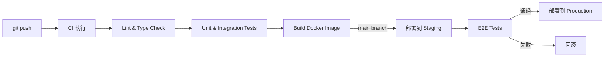

# {專案名稱} 系統設計文件（SD）

**版本**：v0.1  
**建立日期**：{YYYY-MM-DD}  
**最後更新**：{YYYY-MM-DD}  
**對應 SA 文件**：`docs/design/sa-{YYYY-MM-DD}.md`  
**狀態**：草稿 / 審核中 / 已確認

---

## 1. 技術棧確認

| 層次                | 技術                  | 版本      | 說明       |
| ------------------- | --------------------- | --------- | ---------- |
| 前端框架            | {如 React}            | {如 18.x} | {選型理由} |
| 前端狀態管理        | {如 Zustand}          | {版本}    | {說明}     |
| 後端框架            | {如 Fastify}          | {版本}    | {選型理由} |
| 資料庫              | {如 PostgreSQL}       | {版本}    | {說明}     |
| ORM / Query Builder | {如 Drizzle ORM}      | {版本}    | {說明}     |
| 快取                | {如 Redis}            | {版本}    | {說明}     |
| 驗證                | {如 JWT + bcrypt}     | {版本}    | {說明}     |
| 部署                | {如 Docker + Railway} | -         | {說明}     |

---

## 2. 資料庫 Schema 設計

### 2.1 ER 圖（詳細版）



### 2.2 資料表詳細定義

#### `users` 表

| 欄位名        | 型別         | 限制             | 預設值   | 說明               |
| ------------- | ------------ | ---------------- | -------- | ------------------ |
| id            | SERIAL       | PK               | auto     | 主鍵               |
| email         | VARCHAR(255) | NOT NULL, UNIQUE | -        | 登入信箱           |
| password_hash | VARCHAR(255) | NOT NULL         | -        | bcrypt hash        |
| name          | VARCHAR(100) | NOT NULL         | -        | 顯示名稱           |
| role          | VARCHAR(20)  | NOT NULL         | `'user'` | 角色：user / admin |
| created_at    | TIMESTAMP    | NOT NULL         | NOW()    | 建立時間           |
| updated_at    | TIMESTAMP    |                  |          | 更新時間           |
| deleted_at    | TIMESTAMP    |                  | NULL     | 軟刪除時間         |

**索引：**

- `idx_users_email` ON `email`（查詢登入用）

---

## 3. API 設計

### 3.1 共用規範

- **Base URL**：`/api/v1`
- **認證**：Bearer Token（JWT）放於 `Authorization` Header
- **回應格式**：

```json
// 成功
{ "data": { ... }, "meta": { "page": 1, "total": 100 } }

// 錯誤
{ "error": { "code": "UNAUTHORIZED", "message": "描述" } }
```

- **HTTP 狀態碼**：200 成功 / 201 建立 / 400 請求錯誤 / 401 未認證 / 403 無權限 / 404 不存在 / 500 伺服器錯誤

### 3.2 API 清單

#### 認證模組

| Method | 路由             | 說明               | 需要認證 |
| ------ | ---------------- | ------------------ | -------- |
| POST   | `/auth/register` | 使用者註冊         | 否       |
| POST   | `/auth/login`    | 使用者登入         | 否       |
| POST   | `/auth/logout`   | 登出（撤銷 Token） | 是       |
| GET    | `/auth/me`       | 取得當前使用者資訊 | 是       |

#### {功能模組名稱}

| Method | 路由              | 說明                       | 需要認證 |
| ------ | ----------------- | -------------------------- | -------- |
| GET    | `/{resource}`     | 列表查詢（支援分頁、篩選） | 是       |
| POST   | `/{resource}`     | 建立                       | 是       |
| GET    | `/{resource}/:id` | 取得單筆                   | 是       |
| PUT    | `/{resource}/:id` | 更新（全量）               | 是       |
| PATCH  | `/{resource}/:id` | 更新（部分）               | 是       |
| DELETE | `/{resource}/:id` | 刪除（軟刪除）             | 是       |

### 3.3 API 詳述

#### `POST /auth/login`

**Request：**

```json
{
	"email": "user@example.com",
	"password": "plaintext_password"
}
```

**Response 200：**

```json
{
	"data": {
		"access_token": "eyJhbGci...",
		"token_type": "Bearer",
		"expires_in": 3600,
		"user": {
			"id": 1,
			"email": "user@example.com",
			"name": "John Doe",
			"role": "user"
		}
	}
}
```

**Response 401：**

```json
{
	"error": {
		"code": "INVALID_CREDENTIALS",
		"message": "電子郵件或密碼錯誤"
	}
}
```

---

## 4. 前端元件設計

### 4.1 元件樹

```
App
├── Layout
│   ├── Navbar
│   │   ├── Logo
│   │   ├── NavLinks
│   │   └── UserMenu
│   └── Footer
├── pages/
│   ├── HomePage
│   ├── LoginPage
│   │   └── LoginForm
│   ├── DashboardPage
│   └── {FeaturePage}
│       ├── {Feature}List
│       │   └── {Feature}Card
│       └── {Feature}Form
└── shared/
    ├── Button
    ├── Input
    ├── Modal
    └── Toast
```

### 4.2 狀態管理策略

| 狀態類型                    | 管理方式            | 說明                 |
| --------------------------- | ------------------- | -------------------- |
| 伺服器狀態（API 資料）      | {如 TanStack Query} | 快取、重新驗證、同步 |
| 全域 UI 狀態（登入使用者）  | {如 Zustand store}  | 跨元件共享           |
| 區域 UI 狀態（表單、Modal） | React `useState`    | 元件內部管理         |
| URL 狀態（篩選、分頁）      | URL Search Params   | 可書籤、可分享       |

---

## 5. 部署架構

### 5.1 環境規劃

| 環境       | 用途     | 部署方式                        | 網域             |
| ---------- | -------- | ------------------------------- | ---------------- |
| local      | 本機開發 | Docker Compose                  | localhost        |
| staging    | 測試驗收 | {如 Railway / Fly.io}           | staging.{domain} |
| production | 正式上線 | {如 Railway / Vercel + Railway} | {domain}         |

### 5.2 CI/CD 流程



### 5.3 環境變數清單

| 變數名         | 環境 | 說明           | 範例值             |
| -------------- | ---- | -------------- | ------------------ |
| `DATABASE_URL` | 所有 | 資料庫連線字串 | `postgresql://...` |
| `JWT_SECRET`   | 所有 | JWT 簽名金鑰   | 隨機 256-bit 字串  |
| `REDIS_URL`    | 所有 | Redis 連線字串 | `redis://...`      |
| `APP_ENV`      | 所有 | 環境名稱       | `production`       |

---

## 6. 安全性設計

### 6.1 驗證與授權

| 機制              | 實作方式                            | 說明                       |
| ----------------- | ----------------------------------- | -------------------------- |
| 使用者驗證        | JWT（Access Token + Refresh Token） | Access Token 有效期 1 小時 |
| 密碼儲存          | bcrypt（cost factor: 12）           | 絕不儲存明文密碼           |
| RBAC 授權         | Middleware 檢查 role                | user / admin 角色分離      |
| API Rate Limiting | {如 `@fastify/rate-limit`}          | 登入 API：10 次/分鐘       |

### 6.2 安全性 Checklist

- [ ] 所有 API 輸入進行 Schema 驗證（Zod / Joi）
- [ ] SQL 使用參數化查詢，禁止字串拼接
- [ ] 敏感欄位（密碼、Token）不出現在 Log
- [ ] CORS 設定白名單，不使用 `*`
- [ ] HTTPS only（HTTP 自動導向 HTTPS）
- [ ] 依賴套件定期掃描（`npm audit`）
- [ ] 敏感設定透過環境變數注入，不 commit 至 Git

---

## 7. 開放性問題

| #   | 問題   | 影響範圍 | 負責人   | 狀態      |
| --- | ------ | -------- | -------- | --------- |
| Q1  | {問題} | {範圍}   | {負責人} | 🔍 待確認 |

---

## 修訂記錄

| 版本 | 日期   | 修改人 | 變更說明 |
| ---- | ------ | ------ | -------- |
| v0.1 | {日期} | {作者} | 初稿建立 |
