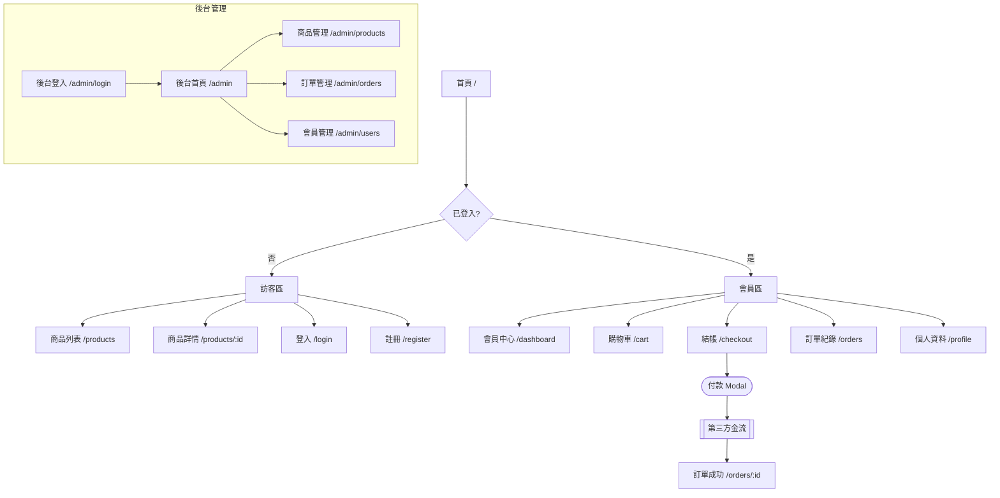

# Sitemap 繪製規範

## 目的

Sitemap 用於呈現系統的頁面結構與使用者導覽路徑，確保團隊對整體頁面架構有共同理解。

---

## Mermaid 語法規範

使用 `graph TD`（Top-Down）繪製 Sitemap。

### 節點類型

| 用途        | 語法             | 範例                         |
| ----------- | ---------------- | ---------------------------- |
| 一般頁面    | `ID[頁面名稱]`   | `Home[首頁]`                 |
| 條件/判斷點 | `ID{條件}`       | `Auth{已登入?}`              |
| 彈窗/Modal  | `ID([彈窗名稱])` | `ConfirmModal([確認對話框])` |
| 外部系統    | `ID[[外部系統]]` | `PaymentGW[[金流服務]]`      |
| 子系統起點  | `ID[(系統名)]`   | `AdminPortal[(後台管理)]`    |

### 邊線類型

| 用途       | 語法      |
| ---------- | --------- | ------------ | ---------- |
| 一般導覽   | `A --> B` |
| 帶標籤導覽 | `A -->    | 動作描述     | B`         |
| 需要權限   | `A -.->   | 需登入       | B`（虛線） |
| 重新導向   | `A ==>    | 302 redirect | B`         |

---

## 結構組織原則

1. **從根節點開始**：通常為首頁（`/`）或進入點
2. **依角色分群**：不同使用者角色的頁面以 `subgraph` 區分
3. **權限邊界明確**：需要登入或特定角色才能存取的頁面用虛線連接並標注
4. **深度控制**：Sitemap 只呈現到頁面層級，不深入元件細節

---

## 範例：電商系統 Sitemap

---

## 頁面清單輔助表

繪製 Sitemap 後，同步產出頁面清單：

| 頁面 ID  | 路由         | 名稱     | 可存取角色 | 對應 REQ |
| -------- | ------------ | -------- | ---------- | -------- |
| PAGE-001 | `/`          | 首頁     | 所有人     | REQ-F001 |
| PAGE-002 | `/login`     | 登入頁   | 訪客       | REQ-F002 |
| PAGE-003 | `/dashboard` | 會員中心 | 登入會員   | REQ-F003 |

---

## 常見錯誤

- **缺少權限邊界**：沒有標示哪些頁面需要登入
- **過度細節**：把 Modal、Toast 等 UI 狀態全部畫入，造成圖表難以閱讀
- **缺少角色分群**：所有頁面混在一起，看不出 C 端 / B 端 / 後台的區分
