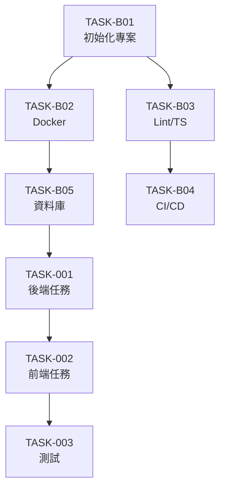

# {專案名稱} 建置計畫

**版本**：v0.1  
**建立日期**：{YYYY-MM-DD}  
**對應 SA**：`docs/design/sa-{YYYY-MM-DD}.md`  
**對應 SD**：`docs/design/sd-{YYYY-MM-DD}.md`

---

## 總覽

| 里程碑        | 任務數  | 總估點   | 目標完成日 |
| ------------- | ------- | -------- | ---------- |
| M0 - 基礎建設 | {n}     | {SP}     | {日期}     |
| M1 - MVP      | {n}     | {SP}     | {日期}     |
| M2 - Beta     | {n}     | {SP}     | {日期}     |
| M3 - Launch   | {n}     | {SP}     | {日期}     |
| **合計**      | **{n}** | **{SP}** |            |

### 估點分布（依類型）

| 類型              | 任務數 | 估點 |
| ----------------- | ------ | ---- |
| Infra（基礎建設） | {n}    | {SP} |
| BE（後端）        | {n}    | {SP} |
| FE（前端）        | {n}    | {SP} |
| Int（整合）       | {n}    | {SP} |
| Test（測試）      | {n}    | {SP} |
| Deploy（部署）    | {n}    | {SP} |

---

## M0 — 基礎建設

> 目標：開發環境與工具鏈就緒，可開始功能開發

| 任務 ID  | 任務標題                              | 類型   | 估點 | 前置 | 狀態 |
| -------- | ------------------------------------- | ------ | :--: | ---- | ---- |
| TASK-B01 | 初始化專案結構與 Monorepo             | Infra  |  2   | -    | 🔲   |
| TASK-B02 | Docker Compose 本機開發環境           | Infra  |  3   | B01  | 🔲   |
| TASK-B03 | ESLint / Prettier / TypeScript 設定   | Infra  |  2   | B01  | 🔲   |
| TASK-B04 | GitHub Actions CI 設定（lint + test） | Infra  |  3   | B03  | 🔲   |
| TASK-B05 | 資料庫初始化與 ORM 設定               | Infra  |  2   | B02  | 🔲   |
| TASK-B06 | Staging 環境部署設定                  | Deploy |  3   | B04  | 🔲   |

---

## M1 — MVP（🔴 必要功能）

> 目標：{M1 目標描述}

### {模組名稱}（MOD-001）

| 任務 ID  | 任務標題   | 類型 | 估點 | 前置 | 狀態 |
| -------- | ---------- | ---- | :--: | ---- | ---- |
| TASK-001 | {任務標題} | BE   |  3   | B05  | 🔲   |
| TASK-002 | {任務標題} | FE   |  3   | 001  | 🔲   |
| TASK-003 | {任務標題} | Test |  2   | 002  | 🔲   |

### {模組名稱}（MOD-002）

| 任務 ID  | 任務標題   | 類型 | 估點 | 前置 | 狀態 |
| -------- | ---------- | ---- | :--: | ---- | ---- |
| TASK-010 | {任務標題} | BE   |  3   | B05  | 🔲   |
| TASK-011 | {任務標題} | FE   |  3   | 010  | 🔲   |

---

## M2 — Beta（🟡 應有功能）

> 目標：{M2 目標描述}

| 任務 ID  | 任務標題   | 類型 | 估點 | 前置 | 狀態 |
| -------- | ---------- | ---- | :--: | ---- | ---- |
| TASK-050 | {任務標題} | BE   |  3   | 001  | 🔲   |

---

## M3 — Launch（🟢 可有功能 + 上線準備）

> 目標：{M3 目標描述}

| 任務 ID  | 任務標題            | 類型   | 估點 | 前置 | 狀態 |
| -------- | ------------------- | ------ | :--: | ---- | ---- |
| TASK-080 | 效能優化            | BE     |  3   | -    | 🔲   |
| TASK-081 | Production 環境部署 | Deploy |  3   | B06  | 🔲   |

---

## 高風險任務清單

> 以下任務因估點高、相依複雜或技術不確定性，需特別關注

| 任務 ID  | 原因   | 緩解措施 |
| -------- | ------ | -------- |
| TASK-XXX | {原因} | {措施}   |

---

## 任務相依圖

---

## 修訂記錄

| 版本 | 日期   | 修改人 | 變更說明 |
| ---- | ------ | ------ | -------- |
| v0.1 | {日期} | {作者} | 初稿建立 |
