# Agent Skills

> 🌐 [English Version](README_EN.md) | 🤝 [貢獻指南 (Contributing)](CONTRIBUTING.md)

本目錄收錄所有 Copilot Agent 的工作流程 Skill，覆蓋從想法萌芽到生產部署的完整產品生命週期。每個 Skill 封裝一套資深工程師遵循的具體流程，讓 Agent 在正確的時機執行正確的事。

> **不知道用哪個？** 告訴 Agent「using-agent-skills」，它會根據你的任務推薦最適合的 Skill。

---

## 產品生命週期地圖

```mermaid
graph TD
    subgraph Ideation
        A[💡 想法 Idea] -->|idea-refine| B[MVP]
        B -->|problem-validation| C[驗證問題 Validated Problem]
    end
    
    subgraph Definition & Design
        C -->|analyze-spec| D[規格定義 Spec]
        D -->|design-architecture| E[架構設計 Architecture]
        E -->|api-and-interface-design| F[API 合約 API Contracts]
    end
    
    subgraph Planning
        F -->|plan-build| G[建置計畫 Build Plan]
        G -->|create-issues| H[建立任務 Issues]
        H -->|context-engineering| I[上下文設定 Agent Context]
    end
    
    subgraph Implementation & Verification
        I -->|write-tests| J[撰寫測試 Tests]
        J -->|tdd-build / incremental| K[開始實作 Implementation]
        K -->|security-and-hardening| L[安全審查 Security]
        L -->|browser-testing| M[瀏覽器驗證 Browser Check]
    end
    
    subgraph Review & Delivery
        M -->|code-review-and-quality| N[程式碼審查 Code Review]
        N -->|git-commit| O[提交 Commit]
        O -->|ci-cd-and-automation| P[CI/CD]
        P -->|documentation-and-adrs| Q[文件與 ADRs]
        Q -->|shipping-and-launch| R[生產部署 Deployment]
    end
    
    subgraph Post-Launch & Maintenance
        R -->|post-deploy-monitoring| S[部署後監控 Health Check]
        S -->|post-launch-optimization| T[成效追蹤 KPI Tracking]
        T -->|retrospective-and-learnings| U[回顧學習 Retrospective]
    end
```



---

## 一個從頭到尾的示範案例

下面用一個具體案例示範這套 skills 怎麼串起來：

**案例：** 你想替 SaaS 產品加入「會員邀請功能」，讓團隊管理者可以邀請同事加入 workspace。

| 階段 | 使用 skill                                                       | 這一步在做什麼                                                                                        | 可以怎麼對 Agent 下指令                                                                        |
| ---- | ---------------------------------------------------------------- | ----------------------------------------------------------------------------------------------------- | ---------------------------------------------------------------------------------------------- |
| 1    | `idea-refine`                                                    | 把模糊想法收斂成 MVP。先界定：誰要邀請誰、最小可行流程是 email 邀請還是分享連結、這一版不做什麼。     | 「我想替 SaaS 產品做會員邀請功能，先幫我用 `idea-refine` 收斂成 MVP。」                        |
| 2    | `problem-validation`                                             | 驗證這是不是值得做的問題。確認真有管理者需要邀請隊友、現有替代方案夠差、成功訊號可以量測。            | 「用 `problem-validation` 幫我驗證 B2B SaaS 團隊是否真的有成員邀請與權限交接痛點。」           |
| 3    | `analyze-spec`                                                   | 把需求寫成 spec。定義角色、邀請流程、驗收標準、失敗情境，例如 email 已存在、邀請過期、重送邀請。      | 「根據這個已驗證問題，幫我用 `analyze-spec` 產出會員邀請功能 spec。」                          |
| 4    | `design-architecture`                                            | 設計系統與流程。切出 invitation token、接受邀請頁、workspace member model、權限邊界。                 | 「根據會員邀請 spec，用 `design-architecture` 產出 sitemap、SA、SD。」                         |
| 5    | `api-and-interface-design`                                       | 定義 API 合約。像是建立邀請、查詢邀請、接受邀請、錯誤格式與狀態碼。                                   | 「幫我用 `api-and-interface-design` 設計 invitation API contract。」                           |
| 6    | `plan-build`                                                     | 把設計拆成可執行任務。區分 backend token 生成、email 發送、accept flow、member onboarding、admin UI。 | 「根據 SA/SD，使用 `plan-build` 拆成 Sprint 任務並標出 critical path。」                       |
| 7    | `create-issues`                                                  | 把任務變成 GitHub Issues 或待辦清單，方便追蹤。                                                       | 「用 `create-issues` 幫我把會員邀請功能的 build plan 轉成 GitHub Issues。」                    |
| 8    | `write-tests`                                                    | 先規劃測試。列出 invitation token 過期、重複接受、權限驗證、accept 後 member 建立等測試案例。         | 「用 `write-tests` 為會員邀請功能建立 test plan 和測試骨架。」                                 |
| 9    | `source-driven-development`                                      | 若使用框架特定能力，例如 auth、server action、transaction，先查官方文件確認 API。                     | 「接受邀請流程要用目前框架的 auth/session API，先用 `source-driven-development` 查官方文件。」 |
| 10   | `tdd-build` 或 `incremental-implementation`                      | 開始實作。先做最薄的一條流程，例如 admin 建立邀請 → email 寄出 → invited user 接受成功。              | 「從 TASK-001 開始，用 `tdd-build` 逐步實作會員邀請功能。」                                    |
| 11   | `frontend-ui-engineering`                                        | 把邀請管理頁、accept invite 頁做成生產品質 UI，處理空狀態、錯誤、loading、responsive。                | 「用 `frontend-ui-engineering` 做會員邀請頁面與接受邀請頁。」                                  |
| 12   | `security-and-hardening`                                         | 檢查 invitation token、權限檢查、濫發邀請、防重放、防枚舉 email。                                     | 「用 `security-and-hardening` 審查會員邀請 flow 的 token 與權限安全性。」                      |
| 13   | `browser-testing-with-devtools`                                  | 在真實瀏覽器驗證邀請建立、accept flow、錯誤提示、網路請求與 console errors。                          | 「用 `browser-testing-with-devtools` 走一遍會員邀請的 e2e 流程。」                             |
| 14   | `code-review-and-quality`                                        | 在合併前做 correctness、readability、security、performance 的全面審查。                               | 「幫我用 `code-review-and-quality` review 會員邀請功能。」                                     |
| 15   | `git-commit` + `documentation-and-adrs` + `ci-cd-and-automation` | 整理 commit、補 README/ADR、確保 CI 會自動驗證這條功能。                                              | 「用 `git-commit` 幫我整理提交，並判斷是否要補 ADR 或 CI 調整。」                              |
| 16   | `shipping-and-launch`                                            | 規劃 rollout。確認是否 feature flag、回滾策略、上線檢查清單。                                         | 「用 `shipping-and-launch` 幫我準備會員邀請功能的 production rollout。」                       |
| 17   | `post-deploy-monitoring`                                         | deploy 後先看健康度。確認錯誤率、accept invite 成功率、email delivery、rollback 訊號。                | 「剛 deploy 完，請用 `post-deploy-monitoring` 幫我跑 30 分鐘健康檢查。」                       |
| 18   | `post-launch-optimization`                                       | 上線一段時間後回頭看 adoption 與 KPI，例如邀請送達率、接受率、workspace activation。                  | 「會員邀請功能上線兩週了，用 `post-launch-optimization` 幫我做成效回顧與優化 backlog。」       |
| 19   | `retrospective-and-learnings`                                    | 最後整理 learnings。哪些估點失準、哪個驗證步驟不足、哪些流程可以變成未來預設模板。                    | 「用 `retrospective-and-learnings` 回顧這次會員邀請功能從 idea 到 launch 的整個流程。」        |

### 這個案例的重點

1. `idea-refine` 不等於需求已成立，中間要用 `problem-validation` 避免把猜測直接寫成 spec。
2. `shipping-and-launch` 不等於事情結束，deploy 後應先進 `post-deploy-monitoring`，穩定後才看 `post-launch-optimization`。
3. `retrospective-and-learnings` 不是可有可無；它負責把這次經驗沉澱成下次更快、更穩的流程。
4. 不是每個案例都要用到所有 skill，但這個示範提供的是一條完整、可落地的參考路徑。

---

## Skills 完整列表

### 💡 想法階段

#### [`idea-refine`](./idea-refine/SKILL.md)

通過結構化的發散與收斂思考，將模糊想法提煉為值得建置的 MVP 概念。

|              |                                                                     |
| ------------ | ------------------------------------------------------------------- |
| **使用時機** | 有一個想法但說不清楚要做什麼；想在投入工程前先確認方向              |
| **觸發詞**   | 「我有個想法」、「幫我想想」、「腦力激盪」、`idea-refine`、`ideate` |
| **輸出**     | `docs/ideas/<name>.md`（問題陳述 + 推薦方向 + MVP 範圍 + 不做清單） |
| **範例**     | 「我想做一個幫開發者追蹤學習進度的工具，幫我提煉這個想法」          |

---

### 📋 定義階段

#### [`problem-validation`](./problem-validation/SKILL.md)

在寫 spec 前驗證問題是否真實、受眾是否明確、替代方案是否不足，以及是否值得繼續投入。

|              |                                                                                 |
| ------------ | ------------------------------------------------------------------------------- |
| **使用時機** | 有想法或功能方向，但還不確定痛點是否真實、需求是否成立                          |
| **觸發詞**   | 「需求驗證」、「problem validation」、「用戶研究」、「驗證痛點」、「discovery」 |
| **輸出**     | `docs/discovery/problem-validation-<date>.md`                                   |
| **範例**     | 「幫我驗證中小團隊是否真的有跨專案任務收斂的問題」                              |

#### [`analyze-spec`](./analyze-spec/SKILL.md)

分析需求並產出結構化的規格書（Spec），定義驗收標準。

|              |                                                           |
| ------------ | --------------------------------------------------------- |
| **使用時機** | 收到客戶需求、功能描述或模糊需求，需要轉化為可執行的規格  |
| **觸發詞**   | 「分析需求」、「寫規格書」、`spec`、`PRD`、`analyze-spec` |
| **輸出**     | `docs/spec/<project>-spec-<date>.md`                      |
| **範例**     | 「幫我分析這份需求文件並產出規格書」                      |

---

### 🏗️ 設計階段

#### [`design-architecture`](./design-architecture/SKILL.md)

根據規格書繪製 Sitemap、切分模組，產出 SA（系統分析）與 SD（系統設計）文件。

|              |                                                                   |
| ------------ | ----------------------------------------------------------------- |
| **使用時機** | Spec 已確認，開始開發前需要確立系統架構、頁面結構與技術設計       |
| **觸發詞**   | 「繪製 sitemap」、「系統設計」、`SA`、`SD`、`design-architecture` |
| **輸出**     | `docs/design/sitemap-<date>.md`、`sa-<date>.md`、`sd-<date>.md`   |
| **範例**     | 「根據 spec，幫我設計系統架構和頁面結構」                         |

#### [`api-and-interface-design`](./api-and-interface-design/SKILL.md)

合約優先設計 REST/GraphQL/函式庫 API，建立型別定義、統一錯誤格式與邊界驗證。

|              |                                                            |
| ------------ | ---------------------------------------------------------- |
| **使用時機** | 設計新 API 端點；需要在實作前確立前後端共用的資料格式      |
| **觸發詞**   | 「設計 API」、「API contract」、`contract-first`、介面合約 |
| **輸出**     | API 規格、TypeScript 型別定義、範例請求/回應               |
| **範例**     | 「幫我設計任務管理系統的 REST API，包含統一的錯誤格式」    |

---

### 📌 規劃階段

#### [`plan-build`](./plan-build/SKILL.md)

根據 SA/SD 文件產出可執行的建置計畫：任務拆解、工作估點與里程碑排程。

|              |                                                             |
| ------------ | ----------------------------------------------------------- |
| **使用時機** | 架構設計完成，準備開始開發前的任務規劃                      |
| **觸發詞**   | 「建置計畫」、「任務拆解」、`Sprint 規劃`、`plan-build`     |
| **輸出**     | `docs/plan/build-plan-<date>.md`、`github-issues-<date>.md` |
| **範例**     | 「根據 SA/SD，幫我規劃這個 Sprint 的任務清單並估點」        |

#### [`create-issues`](./create-issues/SKILL.md)

根據各開發階段的產出，建立 GitHub Issues 或本地待辦任務。

|              |                                                                   |
| ------------ | ----------------------------------------------------------------- |
| **使用時機** | 完成任一開發階段（spec/design/plan/test/build）後需要建立追蹤任務 |
| **觸發詞**   | 「建立 issue」、「create issue」、「建立任務」、追蹤進度          |
| **輸出**     | GitHub Issues（透過 gh CLI）或 `docs/issues/<date>.md`            |
| **範例**     | 「根據建置計畫，幫我建立對應的 GitHub Issues 並加上 label」       |

#### [`context-engineering`](./context-engineering/SKILL.md)

優化 AI Agent 的上下文設置，建立 rules 檔案確保 Agent 遵循專案規範。

|              |                                                                |
| ------------ | -------------------------------------------------------------- |
| **使用時機** | 開始新工作階段；Agent 輸出不符合規範或出現幻覺 API             |
| **觸發詞**   | `context`、「rules 檔案」、`copilot-instructions`、`CLAUDE.md` |
| **輸出**     | `.github/copilot-instructions.md`（或對應工具的 rules 檔案）   |
| **範例**     | 「幫我建立這個 Node.js + React 專案的 Copilot instructions」   |

#### [`post-deploy-monitoring`](./post-deploy-monitoring/SKILL.md)

在 deploy 後的前 10 分鐘到 24 小時內，做 health check、canary 驗證、latency 對比與 rollback 判斷。

|              |                                                                                  |
| ------------ | -------------------------------------------------------------------------------- |
| **使用時機** | 剛完成 deploy，需要確認錯誤率、延遲、關鍵流程與 rollout 是否健康                 |
| **觸發詞**   | 「部署後監控」、「post-deploy」、「canary」、「health check」、「verify deploy」 |
| **輸出**     | `docs/launch/post-deploy-monitoring-<date>.md`                                   |
| **範例**     | 「邀請功能剛上 production，幫我做 30 分鐘的 canary 驗證與 rollback 判斷」        |

#### [`post-launch-optimization`](./post-launch-optimization/SKILL.md)

在功能上線後，用 evidence scorecard、plan-vs-reality 比對與優化 backlog 來追蹤 adoption / KPI / 使用者回饋。

|              |                                                                                   |
| ------------ | --------------------------------------------------------------------------------- |
| **使用時機** | 功能已上線，需要檢查成效、分類回饋、安排下一輪優化                                |
| **觸發詞**   | 「上線後」、「發布後」、「post-launch」、「launch review」、「成效追蹤」、「KPI」 |
| **輸出**     | `docs/launch/post-launch-review-<date>.md`、`optimization-backlog-<date>.md`      |
| **範例**     | 「會員邀請功能上線一週了，幫我做 post-launch review 並整理下一輪優化方向」        |

---

### 🔁 學習與維護階段

#### [`retrospective-and-learnings`](./retrospective-and-learnings/SKILL.md)

在 Sprint、功能或發布後整理 learnings，找出流程模式，並把改善項回寫成文件、skill 或 backlog。

|              |                                                                             |
| ------------ | --------------------------------------------------------------------------- |
| **使用時機** | 一個功能、里程碑或發布結束後，需要回顧流程、風險、學習與下次應改進的地方    |
| **觸發詞**   | 「retro」、「retrospective」、「回顧」、「lessons learned」、「postmortem」 |
| **輸出**     | `docs/retrospectives/retro-<date>.md`                                       |
| **範例**     | 「回顧這次會員邀請功能從 spec 到上線的整個流程，整理可重用 learnings」      |

---

### 🔨 實作階段

#### [`tdd-build`](./tdd-build/SKILL.md)

以 TDD 方式逐一實作建置計畫中的任務（Red → Green → Refactor）。

|              |                                                                    |
| ------------ | ------------------------------------------------------------------ |
| **使用時機** | 建置計畫已確立，開始逐一實作 `TASK-XXX` 任務                       |
| **觸發詞**   | 「開始開發」、`TDD`、「實作任務」、`tdd-build`、Red-Green-Refactor |
| **輸出**     | 實作程式碼 + 通過的測試                                            |
| **範例**     | 「開始實作 TASK-001，使用 TDD 方式」                               |

#### [`incremental-implementation`](./incremental-implementation/SKILL.md)

以薄垂直切片逐步交付功能，每個切片都保持系統可運作。

|              |                                                     |
| ------------ | --------------------------------------------------- |
| **使用時機** | 功能跨越多個檔案；感覺一次要寫很多程式碼            |
| **觸發詞**   | 「逐步實作」、「分批」、`incremental`、薄切片       |
| **輸出**     | 每個切片一個 commit，系統始終在可運作狀態           |
| **範例**     | 「幫我用切片方式實作完整的任務 CRUD，一次只做一層」 |

#### [`source-driven-development`](./source-driven-development/SKILL.md)

每個框架特定的決策都從官方文件取得根據，附上可驗證的引用來源。

|              |                                                                  |
| ------------ | ---------------------------------------------------------------- |
| **使用時機** | 使用框架特定 API 時；需要確認當前版本的最佳實踐                  |
| **觸發詞**   | 「官方文件」、`cite source`、「最新 API」、`source-driven`       |
| **輸出**     | 附有來源 URL 引用的程式碼                                        |
| **範例**     | 「使用 React 19 的 useActionState 實作表單，從官方文件確認用法」 |

#### [`frontend-ui-engineering`](./frontend-ui-engineering/SKILL.md)

建構生產品質的 UI——符合 accessibility、響應式設計、設計系統，避免「AI 美學」。

|              |                                                                |
| ------------ | -------------------------------------------------------------- |
| **使用時機** | 建置或修改 UI 元件；需要生產品質而非 AI 預設外觀               |
| **觸發詞**   | 「UI」、「元件」、`React`、`RWD`、`accessibility`、`component` |
| **輸出**     | 可 accessibility、響應式、符合設計系統的 UI 元件               |
| **範例**     | 「建置任務列表元件，包含空狀態、載入中和錯誤狀態」             |

#### [`security-and-hardening`](./security-and-hardening/SKILL.md)

以 OWASP Top 10 為基準強化程式碼安全性，處理輸入驗證、認證授權與 secrets 管理。

|              |                                                            |
| ------------ | ---------------------------------------------------------- |
| **使用時機** | 處理使用者輸入；實作認證/授權；儲存或傳輸敏感資料          |
| **觸發詞**   | 「安全性」、`SQL injection`、`XSS`、`auth`、`OWASP`        |
| **輸出**     | 通過安全審查清單的程式碼                                   |
| **範例**     | 「審查登入 API 的安全性，確認輸入驗證和 session 設置正確」 |

---

### 🧪 驗證階段

#### [`write-tests`](./write-tests/SKILL.md)

根據 SA/SD 產出測試計畫、單元測試骨架，以及測試完成後的測試報告。

|              |                                                                           |
| ------------ | ------------------------------------------------------------------------- |
| **使用時機** | TDD 實作前需要規劃測試策略；測試完成後需要產出報告                        |
| **觸發詞**   | 「測試計畫」、`test plan`、「撰寫測試」、`write-tests`、`coverage report` |
| **輸出**     | `docs/test/test-plan-<date>.md`、測試骨架檔案、`test-report-<date>.md`    |
| **範例**     | 「根據 SA/SD 幫我建立測試計畫和單元測試骨架」                             |

#### [`browser-testing-with-devtools`](./browser-testing-with-devtools/SKILL.md)

使用 Chrome DevTools MCP 在真實瀏覽器環境驗證 UI 行為、網路請求與 accessibility。

|              |                                                                |
| ------------ | -------------------------------------------------------------- |
| **使用時機** | 需要驗證前端 UI 行為；追蹤 API 請求；確認 accessibility        |
| **觸發詞**   | 「瀏覽器測試」、`devtools`、`e2e`、「UI 驗證」、`network 請求` |
| **輸出**     | 瀏覽器測試報告（含 Console、Network、DOM 狀態）                |
| **範例**     | 「用 DevTools 驗證任務建立流程，確認 API 回應正確且列表更新」  |

---

### 🔍 審查階段

#### [`code-review-and-quality`](./code-review-and-quality/SKILL.md)

從五個維度審查程式碼：正確性、可讀性、架構、安全性、效能。

|              |                                                        |
| ------------ | ------------------------------------------------------ |
| **使用時機** | 審查 PR；合併前的品質把關                              |
| **觸發詞**   | 「code review」、「程式碼審查」、「PR 審查」、`review` |
| **輸出**     | 分類審查意見（🔴 必修 / 🟡 建議 / 🟢 讚）              |
| **範例**     | 「幫我審查這個 PR，重點看安全性和架構設計」            |

#### [`performance-optimization`](./performance-optimization/SKILL.md)

先測量再優化，處理 N+1 查詢、bundle size、Core Web Vitals 等效能問題。

|              |                                                              |
| ------------ | ------------------------------------------------------------ |
| **使用時機** | 使用者回報緩慢；Core Web Vitals 低於門檻；懷疑有效能回歸     |
| **觸發詞**   | 「效能」、`slow`、`LCP`、`N+1`、`bundle size`、`performance` |
| **輸出**     | 有前後測量數據佐證的效能改善                                 |
| **範例**     | 「首頁 LCP 超過 4 秒，幫我找出瓶頸並優化」                   |

#### [`code-simplification`](./code-simplification/SKILL.md)

在不改變行為的前提下移除不必要的複雜度（提早返回、拆分函式、去除過度抽象）。

|              |                                                       |
| ------------ | ----------------------------------------------------- |
| **使用時機** | 函式超過 50 行；嵌套超過 3 層；有只用一次的抽象類別   |
| **觸發詞**   | 「簡化」、「重構」、`refactor`、`simplify`、`cleanup` |
| **輸出**     | 更短、更清晰、測試仍全過的程式碼                      |
| **範例**     | 「這個 TaskService 太複雜了，幫我簡化但不改變行為」   |

---

### 📦 交付階段

#### [`git-commit`](./git-commit/SKILL.md)

整理暫存區、產出符合 Conventional Commits 規範的 commit message，工作區清空後自動升版。

|              |                                                              |
| ------------ | ------------------------------------------------------------ |
| **使用時機** | 完成一個任務或功能後需要提交程式碼                           |
| **觸發詞**   | 「git commit」、「提交」、`commit`、「升版」、`bump version` |
| **輸出**     | 符合規範的 commit + 自動升版的 `package.json`（如適用）      |
| **範例**     | 「幫我提交 TASK-001 的變更，自動產出 commit message」        |

#### [`ci-cd-and-automation`](./ci-cd-and-automation/SKILL.md)

建立 GitHub Actions CI/CD 管線：lint、type-check、test、build、安全掃描、部署。

|              |                                                                   |
| ------------ | ----------------------------------------------------------------- |
| **使用時機** | 設置新專案的 CI/CD；在每次提交時強制執行品質標準                  |
| **觸發詞**   | 「CI/CD」、`github actions`、`workflow`、`pipeline`、`持續整合`   |
| **輸出**     | `.github/workflows/ci.yml`、`deploy.yml`                          |
| **範例**     | 「幫我為這個 Node.js 專案建立完整的 CI 管線，包含測試和安全掃描」 |

#### [`documentation-and-adrs`](./documentation-and-adrs/SKILL.md)

撰寫 ADR（架構決策記錄）、API 文件、README 與 changelog，記錄決策背後的「為什麼」。

|              |                                                                |
| ------------ | -------------------------------------------------------------- |
| **使用時機** | 做出重大架構決策；修改公開 API；交付重要功能後需要留存脈絡     |
| **觸發詞**   | `ADR`、「架構決策」、`README`、`changelog`、「為什麼這樣設計」 |
| **輸出**     | `docs/decisions/ADR-XXX.md`、更新的 README                     |
| **範例**     | 「記錄選擇 PostgreSQL 作為主要資料庫的決策，寫一份 ADR」       |

#### [`shipping-and-launch`](./shipping-and-launch/SKILL.md)

準備生產環境部署：發布前完整檢查清單、功能旗標策略、漸進式推出與回滾計畫。

|              |                                                                 |
| ------------ | --------------------------------------------------------------- |
| **使用時機** | 準備將功能部署到生產環境；需要發布前的完整品質把關              |
| **觸發詞**   | 「部署」、`deploy`、`launch`、「上線」、`rollout`、`pre-launch` |
| **輸出**     | 通過所有項目的發布前清單 + 回滾計畫文件                         |
| **範例**     | 「幫我走一遍任務分享功能的發布前清單，並準備回滾策略」          |

---

### 🔧 維護階段

#### [`debugging-and-error-recovery`](./debugging-and-error-recovery/SKILL.md)

系統性除錯流程：重現 → 定位 → 縮小範圍 → 修復根本原因 → 加入防守測試。

|              |                                                                |
| ------------ | -------------------------------------------------------------- |
| **使用時機** | 遇到 bug、測試失敗、執行期錯誤或建置失敗                       |
| **觸發詞**   | `bug`、`debug`、`error`、`exception`、`crash`、「not working」 |
| **輸出**     | 修復 + 防止回歸的測試                                          |
| **範例**     | 「任務建立後頁面空白，Console 顯示 TypeError，幫我 debug」     |

#### [`deprecation-and-migration`](./deprecation-and-migration/SKILL.md)

安全地廢棄舊系統並遷移消費者：建立替代方案 → 宣告 → 逐一遷移 → 完全移除。

|              |                                                                    |
| ------------ | ------------------------------------------------------------------ |
| **使用時機** | 移除舊系統或 API；決定是否繼續維護 legacy 程式碼                   |
| **觸發詞**   | 「廢棄」、`deprecation`、`migration`、「遷移」、`legacy`、`sunset` |
| **輸出**     | 遷移指南 + 適配器程式碼（如需要）                                  |
| **範例**     | 「廢棄舊版 TaskService，幫我建立遷移計畫和說明文件」               |

---

### 🗺️ Meta Skill

#### [`using-agent-skills`](./using-agent-skills/SKILL.md)

Skill 選擇指南與核心行為原則索引。任何時候不確定從哪裡開始，都可以呼叫這個 Skill。

|              |                                                        |
| ------------ | ------------------------------------------------------ |
| **使用時機** | 開始新工作階段；不確定要用哪個 Skill                   |
| **觸發詞**   | 「用哪個 skill」、「從哪裡開始」、`using-agent-skills` |

---

## 典型使用情境

### 全新產品從零開始

```
idea-refine → analyze-spec → design-architecture
    → api-and-interface-design → plan-build → create-issues
    → context-engineering → write-tests → tdd-build
    → code-review-and-quality → git-commit
    → ci-cd-and-automation → documentation-and-adrs
    → shipping-and-launch
```

### 單一功能開發

```
analyze-spec（確認需求）
    → incremental-implementation（逐切片建置）
    → source-driven-development（框架用法驗證）
    → browser-testing-with-devtools（UI 驗證）
    → code-review-and-quality → git-commit
```

### 修復 Bug

```
debugging-and-error-recovery
    → tdd-build（先補失敗測試，再修復）
    → code-review-and-quality → git-commit
```

### 技術債清理

```
code-simplification（移除複雜度）
    → performance-optimization（如有效能問題）
    → deprecation-and-migration（如有舊 API 需廢棄）
    → documentation-and-adrs → git-commit
```

### 部署前把關

```
security-and-hardening（安全審查）
    → performance-optimization（效能確認）
    → shipping-and-launch（完整發布清單）
```
