# Plan-to-Build: Agent Skills Framework

> 🌐 [中文版 README (Chinese Version)](README.md)

This repository contains a comprehensive workflow framework for Copilot Agents called **Agent Skills**. It covers the entire product lifecycle from idea inception to production deployment. Each Skill encapsulates a specific workflow followed by senior engineers, ensuring that AI Agents do the right thing at the right time.

> **Not sure which one to use?** Tell the Agent `using-agent-skills`, and it will recommend the most suitable Skill based on your current task.

---

## 🗺️ Product Lifecycle Map

```mermaid
graph TD
    subgraph Ideation
        A[💡 Idea] -->|idea-refine| B[MVP Concept]
        B -->|problem-validation| C[Validated Problem]
    end
    
    subgraph Definition & Design
        C -->|analyze-spec| D[Specification]
        D -->|design-architecture| E[Architecture & UI/UX]
        E -->|api-and-interface-design| F[API Contracts]
    end
    
    subgraph Planning
        F -->|plan-build| G[Build Plan]
        G -->|create-issues| H[Issue Tracker]
        H -->|context-engineering| I[Agent Context Set]
    end
    
    subgraph Implementation & Verification
        I -->|write-tests| J[Test Skeleton]
        J -->|tdd-build / incremental-implementation| K[Implementation]
        K -->|security-and-hardening| L[Security Review]
        L -->|browser-testing-with-devtools| M[Browser Verification]
    end
    
    subgraph Review & Delivery
        M -->|code-review-and-quality| N[Code Review]
        N -->|git-commit| O[Commit & Version Bump]
        O -->|ci-cd-and-automation| P[CI/CD Pipeline]
        P -->|documentation-and-adrs| Q[ADRs & Docs]
        Q -->|shipping-and-launch| R[Deployment]
    end
    
    subgraph Post-Launch & Maintenance
        R -->|post-deploy-monitoring| S[Deploy Health Check]
        S -->|post-launch-optimization| T[KPI Tracking]
        T -->|retrospective-and-learnings| U[Retrospective]
    end
```

---

## 🤝 Contributing

We welcome contributions! Please see [CONTRIBUTING.md](CONTRIBUTING.md) for guidelines on how to add new Agent Skills or improve existing ones. Remember to use our standard [SKILL-TEMPLATE.md](docs/templates/SKILL-TEMPLATE.md) when proposing new workflows.

---

## 🚀 Getting Started

If you are an AI Agent reading this:
1. Stop and ask the user what development phase they are in.
2. Consult `.github/copilot-instructions.md` to determine the correct `SKILL.md` to load.
3. Follow the steps exactly as outlined in the specific skill file.
