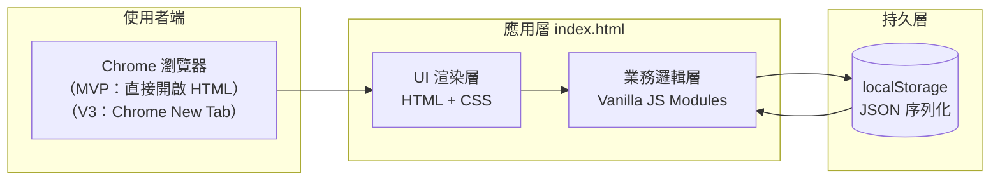
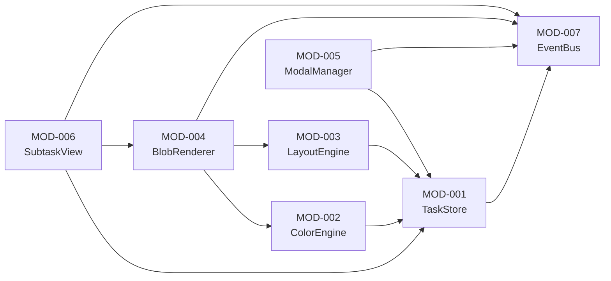
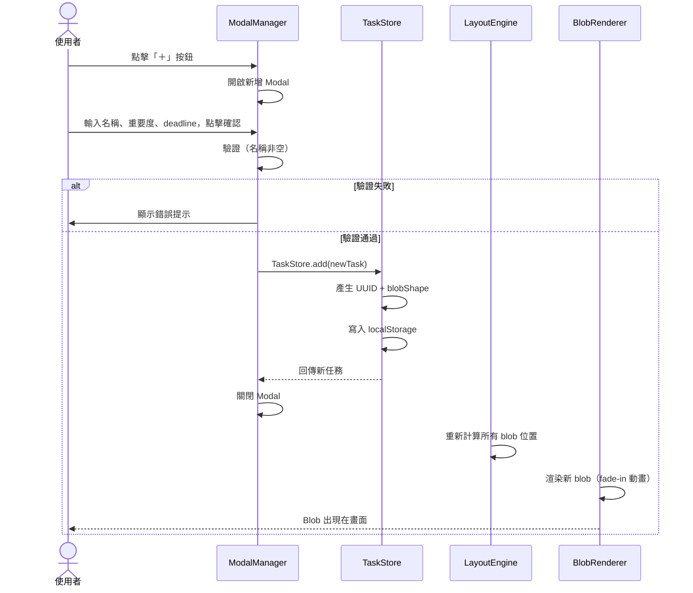
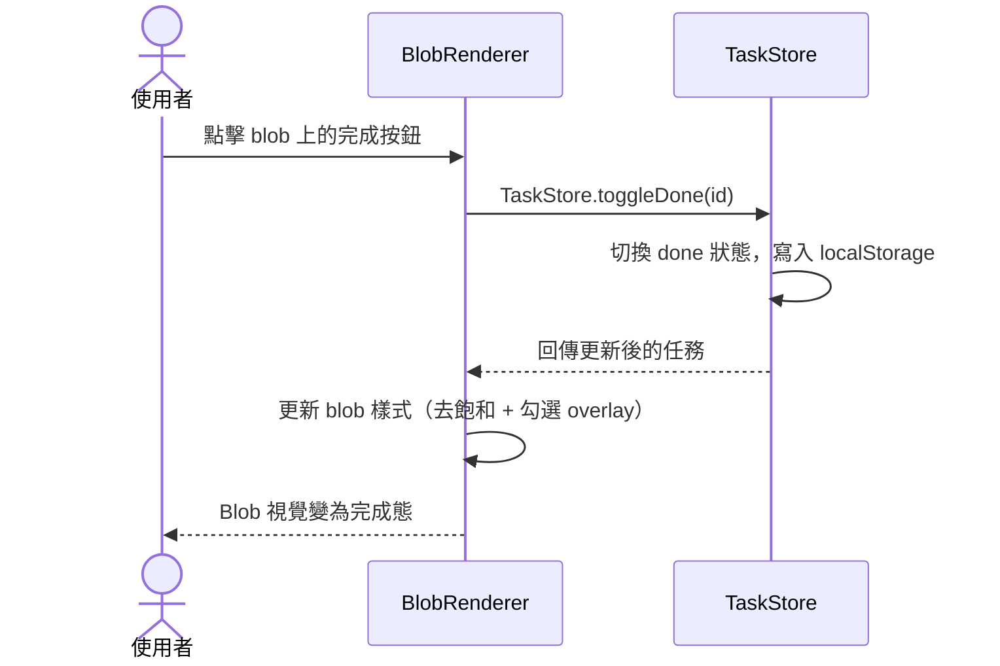
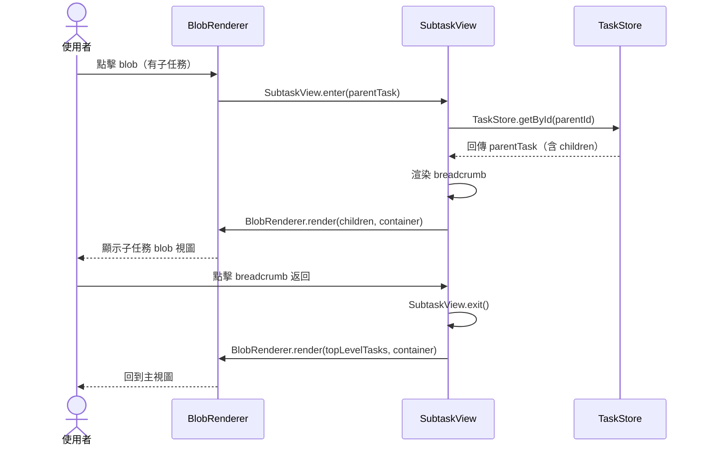
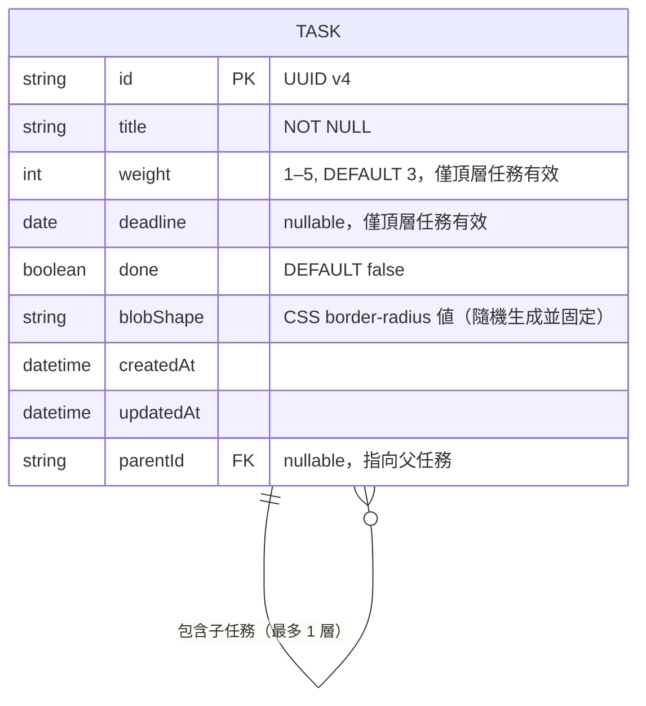

# Blob Todo 系統分析文件（SA）

**版本**：v0.1
**建立日期**：2026-05-09
**最後更新**：2026-05-09
**對應規格書**：`docs/spec/blob-todo-spec-2026-05-09.md`
**狀態**：草稿

---

## 1. 系統架構概觀

### 1.1 架構圖

這是一個**純前端單頁應用**，無後端、無 API，所有狀態存於 localStorage。



### 1.2 架構說明

| 層次 | 技術選型 | 職責 |
| ---- | -------- | ---- |
| UI 渲染層 | HTML5 + CSS3 | DOM 結構、blob 視覺樣式、動畫 |
| 業務邏輯層 | Vanilla JS ES2022 | 任務 CRUD、版面計算、顏色計算、事件處理 |
| 持久層 | localStorage（JSON） | 任務資料持久化，無後端 |

---

## 2. 功能模組切分

### 2.1 模組清單

| 模組 ID | 模組名稱 | 職責描述 | 對應 REQ | 相依模組 |
| ------- | -------- | -------- | -------- | -------- |
| MOD-001 | TaskStore | 任務資料的 CRUD、localStorage 讀寫、資料結構管理 | REQ-F004~F008 | - |
| MOD-002 | ColorEngine | 根據 deadline 計算 blob 顏色（HSL） | REQ-F003 | MOD-001 |
| MOD-003 | LayoutEngine | 計算每個 blob 的位置與大小（圓形 bin packing 近似） | REQ-F001, F002, F009 | MOD-001 |
| MOD-004 | BlobRenderer | 依據任務資料渲染 blob DOM 元素，套用樣式 | REQ-F001, F007, F011 | MOD-002, MOD-003 |
| MOD-005 | ModalManager | 管理新增/編輯 Modal 的開關、表單驗證、送出 | REQ-F004, F005, F006 | MOD-001 |
| MOD-006 | SubtaskView | 管理子任務視圖的進入/返回、breadcrumb 渲染 | REQ-F010 | MOD-001, MOD-004 |
| MOD-007 | EventBus | 模組間的事件通訊（避免直接耦合） | 所有 | - |

### 2.2 模組相依圖



### 2.3 各模組詳述

#### MOD-001：TaskStore

**職責**：任務資料的單一真實來源（Single Source of Truth）。負責 CRUD 操作和 localStorage 序列化/反序列化。

**提供的介面**：
- `TaskStore.getAll()` → `Task[]`：取得所有頂層任務
- `TaskStore.getById(id)` → `Task`：取得單一任務
- `TaskStore.add(task)` → `Task`：新增任務，自動產生 UUID 和 blobShape
- `TaskStore.update(id, partial)` → `Task`：更新任務欄位
- `TaskStore.delete(id)` → `void`：刪除任務（含子任務）
- `TaskStore.toggleDone(id)` → `Task`：切換完成狀態

**狀態觸發**：每次寫入操作後，發送 `tasks:changed` 事件至 EventBus

#### MOD-002：ColorEngine

**職責**：純函式，根據 deadline 和今天日期計算對應的 HSL 色彩字串。

**提供的介面**：
- `ColorEngine.getColor(deadline?: Date)` → `string`：回傳 HSL 色彩值

**顏色映射邏輯**：
```
無 deadline → hsl(220, 10%, 40%)   # 冷灰
> 7 天     → hsl(142, 70%, 45%)   # 冷綠
3–7 天     → hsl(45, 95%, 55%)    # 黃
1–3 天     → hsl(25, 95%, 58%)    # 橘
< 1 天     → hsl(0, 85%, 60%)     # 紅
```

#### MOD-003：LayoutEngine

**職責**：計算所有 blob 的位置（x, y）和半徑，確保不嚴重重疊，適配視窗大小。

**提供的介面**：
- `LayoutEngine.calculate(tasks: Task[], viewport: {w, h})` → `LayoutResult[]`：回傳每個任務的位置和半徑

**演算法**：
1. 依重要度計算半徑：`r = BASE_RADIUS * sqrt(weight)`（BASE_RADIUS 根據視窗和任務數動態調整）
2. 初始放置：從視窗中心向外螺旋分佈
3. 執行最多 50 次排斥力迭代，推開重疊的 blob
4. 邊界碰撞：確保 blob 不超出視窗邊緣（留 padding）

#### MOD-004：BlobRenderer

**職責**：將任務資料渲染成 DOM 元素，管理 blob 的視覺狀態（hover、done、顏色）。

**提供的介面**：
- `BlobRenderer.render(tasks: Task[], container: HTMLElement)` → `void`：完整重繪
- `BlobRenderer.updateBlob(id: string)` → `void`：局部更新單一 blob

**Blob DOM 結構**：
```html
<div class="blob" data-id="{id}" style="...">
  <span class="blob-title">{title}</span>
  <button class="blob-done-btn" aria-label="標記完成">✓</button>
</div>
```

#### MOD-005：ModalManager

**職責**：控制新增/編輯 Modal 的生命週期，處理表單驗證和送出。

**提供的介面**：
- `ModalManager.openAdd(parentId?: string)` → `void`：開啟新增 Modal
- `ModalManager.openEdit(taskId: string)` → `void`：開啟編輯 Modal（帶入現有資料）
- `ModalManager.close()` → `void`：關閉 Modal

#### MOD-006：SubtaskView

**職責**：管理從主視圖進入子任務視圖的狀態切換、breadcrumb 渲染和返回邏輯。

**提供的介面**：
- `SubtaskView.enter(parentTask: Task)` → `void`：進入子任務視圖
- `SubtaskView.exit()` → `void`：返回主視圖

---

## 3. 使用者流程圖（Use Case Sequence Diagrams）

### UC-002：新增任務

> 對應規格書 UC-002



### UC-004：標記任務完成

> 對應規格書 UC-004



### UC-005：查看子任務

> 對應規格書 UC-005



---

## 4. 資料模型概觀（Entity Relationship）



### 主要實體說明

| 實體 | 說明 | 關聯 |
| ---- | ---- | ---- |
| TASK | 任務，頂層或子任務均使用同一結構 | parentId 為 null 表示頂層任務；非 null 表示子任務 |

> ℹ️ **子任務結構決策**：子任務**不使用** weight 和 deadline 欄位（讀取時忽略、模型上保留但不顯示）。父任務的 blob 上會顯示對應最近一筆未完成子任務的名稱。

**localStorage 儲存格式**：
```json
{
  "tasks": [
    {
      "id": "uuid-v4",
      "title": "完成季度報告",
      "weight": 5,
      "deadline": "2026-05-12",
      "done": false,
      "blobShape": "60% 40% 30% 70% / 60% 30% 70% 40%",
      "parentId": null,
      "createdAt": "2026-05-09T10:00:00.000Z",
      "updatedAt": "2026-05-09T10:00:00.000Z"
    },
    {
      "id": "uuid-v4-child",
      "title": "收集數據",
      "weight": 3,
      "deadline": null,
      "done": false,
      "blobShape": "40% 60% 70% 30% / 40% 70% 30% 60%",
      "parentId": "uuid-v4",
      "createdAt": "2026-05-09T10:05:00.000Z",
      "updatedAt": "2026-05-09T10:05:00.000Z"
    }
  ]
}
```

---

## 5. 頁面與模組對應

| 視圖 ID | 視圖名稱 | 涉及模組 | 主要操作 |
| ------- | -------- | -------- | -------- |
| VIEW-001 | 主視圖 Blob Canvas | MOD-001, MOD-003, MOD-004 | 讀取、渲染、標記完成 |
| VIEW-002 | 空狀態 | MOD-001, MOD-005 | 觸發新增 |
| VIEW-003 | 子任務視圖 | MOD-001, MOD-004, MOD-006 | 子任務 CRUD |
| OVERLAY-001 | 新增 Modal | MOD-001, MOD-005 | 新增任務 |
| OVERLAY-002 | 編輯 Modal | MOD-001, MOD-005 | 編輯 / 刪除任務 |

---

## 6. 開放性問題

| # | 問題 | 影響模組 | 狀態 |
| --- | ---- | -------- | ---- |
| Q1 | 子任務不需要獨立的 weight/deadline；父 blob 顯示最近未完成子任務名稱 | MOD-001, MOD-004 | ✅ 已解決 |
| Q2 | 完成任務保留反灰，直到手動刪除 | MOD-001, MOD-004 | ✅ 已解決 |
| Q3 | 頂層任務無數量上限 | MOD-003 | ✅ 已解決 |
| Q4 | ResizeObserver 觸發重算時是否保留 blob 相對位置？ | MOD-003, MOD-004 | 🔍 待確認 |

---

## 修訂記錄

| 版本 | 日期 | 修改人 | 變更說明 |
| ---- | ---- | ------ | -------- |
| v0.1 | 2026-05-09 | soysen | 初稿建立 |
