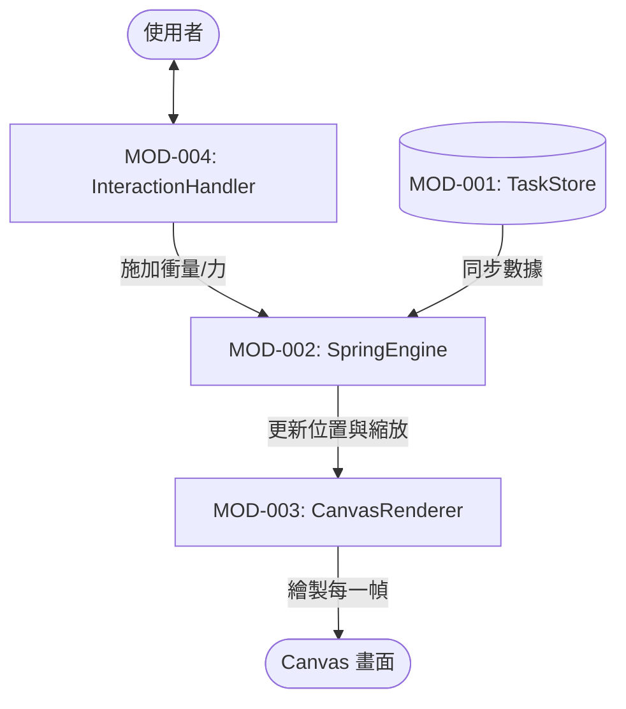
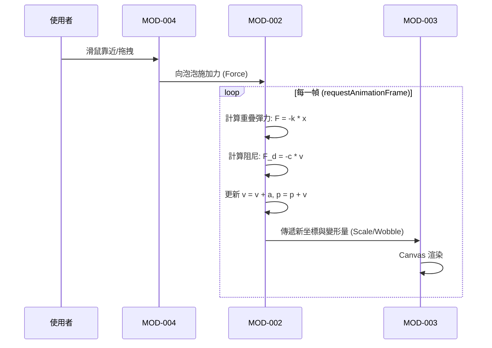

# SA: 彈簧泡泡物理系統分析 (System Analysis)

## 1. 系統架構圖

## 2. 功能模組切分

| 模組 ID | 名稱 | 職責 |
| --- | --- | --- |
| MOD-001 | TaskStore | 負責任務資料持久化。 |
| MOD-002 | SpringEngine | 核心物理迴圈。計算 Spring Force、Damping 與 Brownian Drift。 |
| MOD-003 | CanvasRenderer | 高頻渲染。處理畫布清除、泡泡路徑繪製與 Gooey Filter 應用。 |
| MOD-004 | InteractionHandler | 將滑鼠移動轉化為物理場中的力或速度改变量。 |

## 3. 使用者流程圖 (彈性推擠)

