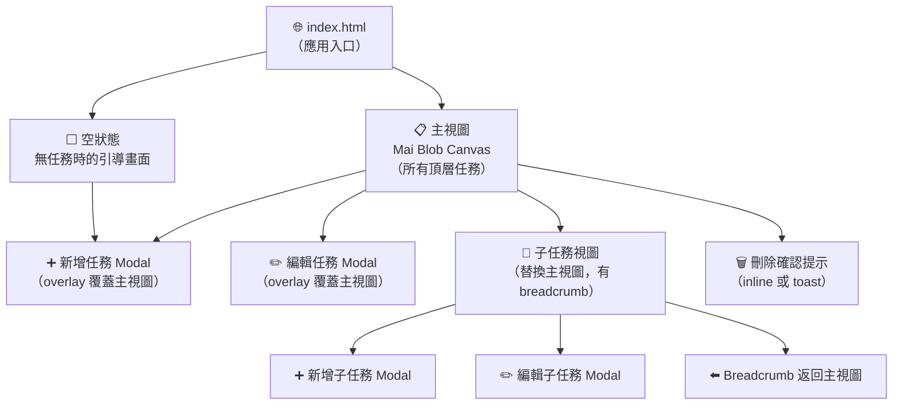
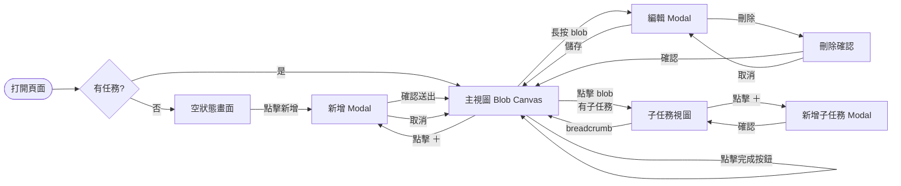

# Blob Todo Sitemap

**版本**：v0.1
**建立日期**：2026-05-09
**對應規格書**：`docs/spec/blob-todo-spec-2026-05-09.md`

---

## 頁面結構圖

這是一個**單頁應用（SPA）**，無路由切換，以「視圖狀態」區分畫面。

---

## 視圖狀態說明

| 視圖 ID | 名稱 | 觸發條件 | 主要功能 |
| ------- | ---- | -------- | -------- |
| VIEW-001 | 主視圖（Main Blob Canvas） | 預設 / 無任務以外情況 | 顯示所有頂層任務 blob |
| VIEW-002 | 空狀態（Empty State） | `tasks.length === 0` | 引導使用者新增第一個任務 |
| VIEW-003 | 子任務視圖（Subtask View） | 點擊有子任務的 blob | 顯示該任務的子任務 blob |
| OVERLAY-001 | 新增任務 Modal | 點擊「＋」按鈕 | 輸入名稱、重要度、deadline |
| OVERLAY-002 | 編輯任務 Modal | 長按 / 右鍵 blob | 修改任務資料 |
| OVERLAY-003 | 刪除確認 | 編輯 Modal 點刪除 | 二次確認防誤刪 |

---

## 使用者動線圖

---

## 修訂記錄

| 版本 | 日期 | 修改人 | 變更說明 |
| ---- | ---- | ------ | -------- |
| v0.1 | 2026-05-09 | soysen | 初稿建立 |
