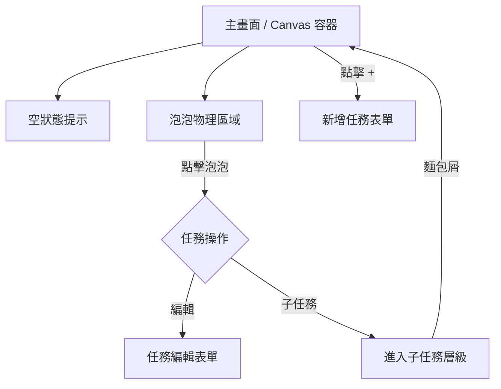

# Blob Todo Sitemap

**版本**：v0.1  
**建立日期**：2026-05-11  
**最後更新**：2026-05-11  
**狀態**：已確認

---

## 1. 頁面結構

---

## 2. 功能動線

- **主動線**：開啟應用 -> 觀察泡泡分佈 -> 點擊泡泡進行編輯或進入子層級。
- **物理互動**：拖拽泡泡會導致其他泡泡被推開，碰撞時會產生形變。
- **完成任務**：右鍵點擊（或長按）泡泡，泡泡消失，文字標籤同步移除。
