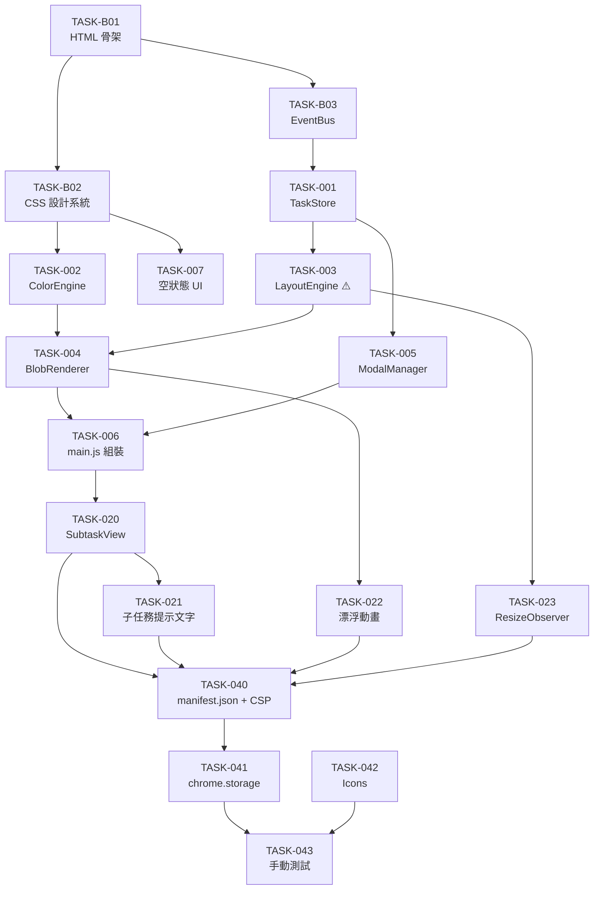

# Blob Todo 建置計畫

**版本**：v0.1
**建立日期**：2026-05-09
**對應 SA**：`docs/design/sa-2026-05-09.md`
**對應 SD**：`docs/design/sd-2026-05-09.md`

---

## 總覽

| 里程碑 | 任務數 | 總估點 | 目標 |
| ---- | ---- | ---- | ---- |
| M0 - 基礎骨架 | 3 | 3 SP | HTML 結構、CSS 設計系統、EventBus 就緒 |
| M1 - MVP | 7 | 18 SP | 核心 blob 視覺化 + CRUD + localStorage 可用 |
| M2 - 完整功能 | 4 | 8 SP | 子任務視圖 + 動畫 + Resize 自適應 |
| M3 - Chrome Extension | 4 | 8 SP | 打包上架，Chrome New Tab 替換 |
| **合計** | **18** | **37 SP** | |

### 估點分布（依類型）

| 類型 | 任務數 | 估點 |
| ---- | ---- | ---- |
| FE（前端邏輯） | 15 | 32 SP |
| Infra（基礎建設） | 2 | 4 SP |
| Test（手動驗證） | 1 | 1 SP |
| **合計** | **18** | **37 SP** |

> ⚠️ 這是個人專案，無歷史 velocity。建議第一次開發時以 60–70% 完成量估算時程，並在 M1 完成後校準實際速度再預估 M2。

---

## M0 — 基礎骨架

> 目標：HTML 骨架、CSS 設計 Token、EventBus 模組就緒，所有後續任務的開發基礎

| 任務 ID | 任務標題 | 類型 | 估點 | 前置 | 狀態 |
| ---- | ---- | ---- | :--: | ---- | ---- |
| TASK-B01 | 建立 `index.html` 骨架與 DOM 結構 | Infra | 1 | - | 🔲 |
| TASK-B02 | 建立 CSS 設計系統（Custom Properties、reset、字體、深色主題） | FE | 1 | B01 | 🔲 |
| TASK-B03 | 實作 EventBus 模組（MOD-007） | FE | 1 | B01 | 🔲 |

### 任務詳述

#### TASK-B01：建立 `index.html` 骨架

建立完整的 HTML 結構：
- `<header>`：breadcrumb 區域 + 新增按鈕
- `<main id="blob-canvas">`：blob 渲染容器
- `<div id="empty-state">`：空狀態容器
- `<dialog id="task-modal">`：新增/編輯 Modal（含完整表單 DOM）

#### TASK-B02：CSS 設計系統

定義所有 CSS Custom Properties：
```css
:root {
  --bg: #0a0a0f;
  --surface: rgba(255,255,255,0.05);
  --text: rgba(255,255,255,0.92);
  --text-muted: rgba(255,255,255,0.45);
  --color-far: hsl(142,70%,45%);   /* 冷綠 */
  --color-mid: hsl(45,95%,55%);    /* 黃 */
  --color-near: hsl(25,95%,58%);   /* 橘 */
  --color-urgent: hsl(0,85%,60%);  /* 紅 */
  --color-none: hsl(220,10%,40%);  /* 灰 */
  --color-done: hsl(220,8%,35%);   /* 完成態 */
}
```

#### TASK-B03：EventBus 模組

簡單的發布/訂閱，讓模組間解耦：
```javascript
// 事件清單：tasks:changed, modal:open, modal:close, view:enter-subtask, view:exit-subtask
```

---

## M1 — MVP（🔴 必要功能）

> 目標：打開 `index.html` 即可看到 blob 視覺化任務全局圖，CRUD 完整可用，localStorage 持久化

| 任務 ID | 任務標題 | 類型 | 估點 | 前置 | 狀態 |
| ---- | ---- | ---- | :--: | ---- | ---- |
| TASK-001 | 實作 TaskStore（MOD-001）：CRUD + localStorage | FE | 3 | B03 | 🔲 |
| TASK-002 | 實作 ColorEngine（MOD-002）：deadline → HSL 顏色 | FE | 1 | B02 | 🔲 |
| TASK-003 | 實作 LayoutEngine（MOD-003）：blob 位置計算 | FE | 5 | 001 | 🔲 |
| TASK-004 | 實作 BlobRenderer（MOD-004）：DOM 渲染 + 視覺狀態 | FE | 3 | 002, 003 | 🔲 |
| TASK-005 | 實作 ModalManager（MOD-005）：新增/編輯 Modal + 表單驗證 | FE | 3 | 001 | 🔲 |
| TASK-006 | 組裝 main.js：整合所有模組 + 事件串接 + 初始渲染 | FE | 2 | 004, 005 | 🔲 |
| TASK-007 | 實作空狀態 UI（Empty State） | FE | 1 | B02 | 🔲 |

### 任務詳述

#### TASK-001：TaskStore（MOD-001）

實作 `TaskStore` 物件，提供：
- `getTopLevel()` → 取所有 `parentId === null` 的任務
- `getChildren(parentId)` → 取子任務
- `getById(id)` → 單一任務
- `getNextSubtaskHint(parentId)` → 最近未完成子任務 title
- `add(data)` → 自動產生 UUID、blobShape（隨機 `border-radius` 八值）
- `update(id, partial)` → 部分更新
- `delete(id)` → 刪除含子任務
- `toggleDone(id)` → 切換完成狀態
- `_load()` / `_save()` → localStorage 讀寫（key: `blob-todo-tasks`）

**驗收標準**：
- [ ] 新增任務後 localStorage 有對應資料
- [ ] 刪除頂層任務時子任務一併刪除
- [ ] `getNextSubtaskHint` 只回傳未完成的子任務

#### TASK-002：ColorEngine（MOD-002）

純函式 `getColor(deadline)` → HSL 色彩字串。

**驗收標準**：
- [ ] null → `hsl(220, 10%, 40%)`
- [ ] > 7 天 → `hsl(142, 70%, 45%)`
- [ ] 3–7 天 → `hsl(45, 95%, 55%)`
- [ ] 1–3 天 → `hsl(25, 95%, 58%)`
- [ ] < 1 天或過期 → `hsl(0, 85%, 60%)`
- [ ] 以今天 00:00 為基準計算天數（不含時間）

#### TASK-003：LayoutEngine（MOD-003）⚠️ 高風險

實作 `calculate(tasks, {w, h})` → 每個任務的 `{id, x, y, r}` 陣列。

**演算法步驟**：
1. `calcBaseRadius(taskCount, w, h)` → 動態 base radius（總面積約佔視窗 60%）
2. `calcRadius(weight, baseRadius)` → `baseRadius * sqrt(weight / 3)`
3. 初始位置：從視窗中心向外螺旋展開
4. 執行最多 50 次排斥力迭代（相互推開 + 邊界回彈）
5. 確保每個 blob 中心距離 ≥ `r1 + r2 + 8px`（gap）

**驗收標準**：
- [ ] 重要度 5 的 blob 半徑是重要度 1 的 `sqrt(5)` 倍
- [ ] 所有 blob 在視窗邊界內（留 padding 16px）
- [ ] 50 次迭代後無明顯重疊
- [ ] 空陣列輸入回傳空陣列

#### TASK-004：BlobRenderer（MOD-004）

實作完整的 blob DOM 生命週期：

- `render(tasks, container)` → 清空容器並重繪所有 blob
- `updateBlob(id)` → 局部更新單一 blob 樣式
- 每個 blob DOM 結構依 SD 4.3 規格

**驗收標準**：
- [ ] Blob 位置與 LayoutEngine 計算結果一致
- [ ] 完成態 blob 顏色變灰 + 勾選 overlay 顯示
- [ ] 父 blob 有子任務時顯示 `.blob-subtask-hint` 文字
- [ ] hover 時放大 1.04 倍

#### TASK-005：ModalManager（MOD-005）

實作新增/編輯 Modal 的完整邏輯：

- `openAdd(parentId?)` → 清空表單，標題「新增任務」
- `openEdit(taskId)` → 帶入現有資料，標題「編輯任務」，顯示刪除按鈕
- `close()` → 關閉 dialog，重置表單
- 表單驗證：title trim 後非空才能送出
- 重要度滑桿：即時更新顯示數字（1–5）

**驗收標準**：
- [ ] 名稱為空送出時顯示錯誤訊息，不關閉 Modal
- [ ] 編輯 Modal 帶入現有任務資料
- [ ] 刪除時彈出 `confirm()`，確認後才執行
- [ ] `Escape` 鍵可關閉 Modal
- [ ] 滑桿值即時顯示

#### TASK-006：main.js 組裝

- 頁面載入時：`TaskStore._load()` → `BlobRenderer.render()`
- `+` 按鈕 → `ModalManager.openAdd()`
- Modal 送出 → `TaskStore.add/update` → `BlobRenderer.render()`
- Blob 長按/右鍵 → `ModalManager.openEdit(id)`
- Blob 完成按鈕點擊 → `TaskStore.toggleDone(id)` → `BlobRenderer.updateBlob(id)`
- `tasks:changed` 事件 → 切換空狀態顯示

**驗收標準**：
- [ ] 完整使用流程（新增 → 顯示 → 編輯 → 完成 → 刪除）在 1 分鐘內可完成
- [ ] 重整頁面後資料仍存在
- [ ] 空狀態在無任務時顯示、有任務時隱藏

#### TASK-007：空狀態 UI

深色背景上的引導文字和「+ 新增第一個任務」按鈕。視覺上不突兀，融入整體設計。

---

## M2 — 完整功能（🟡 應有功能）

> 目標：子任務視圖可用、漂浮動畫加入、視窗縮放自適應

| 任務 ID | 任務標題 | 類型 | 估點 | 前置 | 狀態 |
| ---- | ---- | ---- | :--: | ---- | ---- |
| TASK-020 | 實作 SubtaskView（MOD-006）：進入/返回 + breadcrumb | FE | 3 | 006 | 🔲 |
| TASK-021 | 父 blob 子任務提示文字（最近未完成子任務名稱） | FE | 2 | 020 | 🔲 |
| TASK-022 | 加入 blob 漂浮 CSS keyframe 動畫 | FE | 1 | 004 | 🔲 |
| TASK-023 | 實作 ResizeObserver 視窗縮放重排 | FE | 2 | 003 | 🔲 |

### 任務詳述

#### TASK-020：SubtaskView（MOD-006）

- `enter(parentTask)` → 記錄 `currentParentId`，重新渲染子任務 blob，顯示 breadcrumb
- `exit()` → 清除 `currentParentId`，回到頂層任務視圖
- breadcrumb 格式：`所有任務 › {parentTask.title}`

**驗收標準**：
- [ ] 點擊有子任務的 blob 進入子任務視圖
- [ ] 子任務可新增/編輯/刪除/標記完成
- [ ] breadcrumb 點擊返回主視圖
- [ ] 無子任務的 blob 點擊開啟編輯 Modal（不進入子任務視圖）

#### TASK-022：漂浮動畫

每個 blob 在建立時隨機分配 `--float-duration`（5–8s）和 `--float-delay`（0–3s），確保各 blob 晃動節奏不同。

#### TASK-023：ResizeObserver

監聽 `blob-canvas` 大小變化，觸發 `LayoutEngine.calculate()` 重新計算並更新所有 blob 位置（不重建 DOM，只更新 `style.left`、`style.top`）。

---

## M3 — Chrome Extension（🟢 上線準備）

> 目標：打包成 Chrome Extension，替換 New Tab 頁面

| 任務 ID | 任務標題 | 類型 | 估點 | 前置 | 狀態 |
| ---- | ---- | ---- | :--: | ---- | ---- |
| TASK-040 | 建立 `manifest.json`（Manifest V3）並調整 CSP | Infra | 3 | 全 M2 | 🔲 |
| TASK-041 | 將 `localStorage` 替換為 `chrome.storage.local` | FE | 2 | 040 | 🔲 |
| TASK-042 | 製作 Extension icons（16 / 48 / 128px） | FE | 1 | - | 🔲 |
| TASK-043 | 手動測試 Extension（開發者模式載入 + 功能驗證） | Test | 2 | 041, 042 | 🔲 |

### 任務詳述

#### TASK-040：Manifest V3 + CSP 調整

**manifest.json 重點欄位**：
```json
{
  "manifest_version": 3,
  "name": "Blob Todo",
  "chrome_url_overrides": { "newtab": "index.html" },
  "permissions": ["storage"]
}
```

**CSP 調整**：
- 移除所有 inline event handler（`onclick` → `addEventListener`）
- 將 `<script type="module">` 內容分拆為外部 `.js` 檔案

#### TASK-041：chrome.storage.local

`TaskStore._load()` / `_save()` 改為非同步，包裝 `chrome.storage.local.get` / `set`。需要在整個應用初始化流程加入 `await`。

---

## 高風險任務清單

| 任務 ID | 原因 | 緩解措施 |
| ---- | ---- | ---- |
| TASK-003 | LayoutEngine 排斥力演算法複雜度高，極端情況（大量小 blob）可能排列不佳 | 先以 5 個任務測試，加入最小半徑保護（`r >= 40px`），超出邊界時允許輕微超出 |
| TASK-041 | `chrome.storage.local` 是非同步 API，需改寫整個 TaskStore 讀寫流程，影響面廣 | M1/M2 保持 localStorage，M3 統一切換，不混用 |

---

## 任務相依圖



### Critical Path

```
B01 → B03 → TASK-001 → TASK-003 → TASK-004 → TASK-006 → TASK-020 → TASK-040 → TASK-041 → TASK-043
```

任何一個節點延誤都會直接影響最終交付。**TASK-003（LayoutEngine）是最大風險點**。

---

## 修訂記錄

| 版本 | 日期 | 修改人 | 變更說明 |
| ---- | ---- | ------ | -------- |
| v0.1 | 2026-05-09 | soysen | 初稿建立 |
