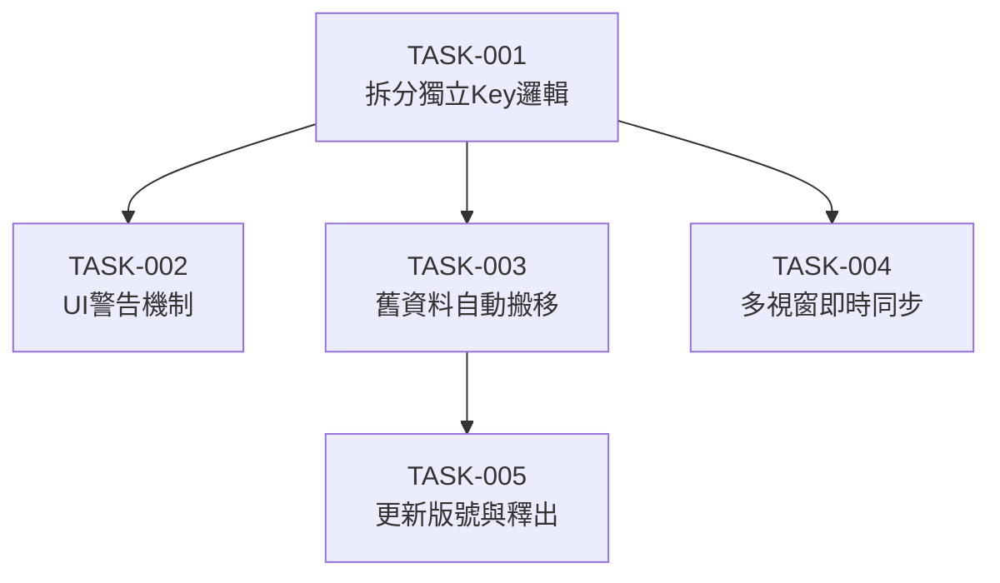

# Blob Todo 跨裝置同步建置計畫

**版本**：v0.1  
**建立日期**：2026-06-04  
**對應 Spec**：`docs/spec/blob-todo-sync-spec-2026-06-04.md`

---

## 總覽

| 里程碑        | 任務數  | 總估點   | 目標完成日 |
| ------------- | ------- | -------- | ---------- |
| M1 - Refactor | 2       | 5        | 2026-06-05 |
| M2 - Migration| 2       | 4        | 2026-06-05 |
| M3 - Launch   | 1       | 1        | 待定       |
| **合計**      | **5**   | **10**   |            |

### 估點分布（依類型）

| 類型              | 任務數 | 估點 |
| ----------------- | ------ | ---- |
| FE（前端邏輯）    | 4      | 9    |
| Deploy（部署）    | 1      | 1    |

---

## M1 — Refactor（🔴 必要功能）

> 目標：改寫 TaskStore，適應 Chrome Sync 限制

| 任務 ID  | 任務標題                                | 類型 | 估點 | 前置 | 狀態 |
| -------- | --------------------------------------- | ---- | :--: | ---- | ---- |
| TASK-001 | 拆分 TaskStore 寫入/讀取邏輯為獨立 Key  | FE   |  3   | -    | ✅   |
| TASK-002 | 實作任務數量 > 400 時的 UI 警告機制     | FE   |  2   | 001  | ✅   |

---

## M2 — Migration（🔴 必要功能 / 🟡 應有功能）

> 目標：舊資料平滑轉移與多視窗即時同步

| 任務 ID  | 任務標題                                | 類型 | 估點 | 前置 | 狀態 |
| -------- | --------------------------------------- | ---- | :--: | ---- | ---- |
| TASK-003 | 實作舊資料自動從 local 搬移至 sync 機制 | FE   |  2   | 001  | ✅   |
| TASK-004 | 實作 `chrome.storage.onChanged` 同步監聽| FE   |  2   | 001  | ✅   |

---

## M3 — Launch（🟢 可有功能 + 上線準備）

> 目標：更新發布

| 任務 ID  | 任務標題            | 類型   | 估點 | 前置 | 狀態 |
| -------- | ------------------- | ------ | :--: | ---- | ---- |
| TASK-005 | 更新 Manifest 版號與釋出打包 | Deploy |  1   | 003  | ✅   |

---

## 高風險任務清單

> 以下任務因估點高、相依複雜或技術不確定性，需特別關注

| 任務 ID  | 原因   | 緩解措施 |
| -------- | ------ | -------- |
| TASK-001 | 若未正確處理非同步寫入，可能導致資料遺失。 | 加入單元測試或手動測試確保讀寫成功。 |

---

## 任務相依圖

---

## 修訂記錄

| 版本 | 日期   | 修改人 | 變更說明 |
| ---- | ------ | ------ | -------- |
| v0.1 | 2026-06-04 | Antigravity | 初稿建立 |
