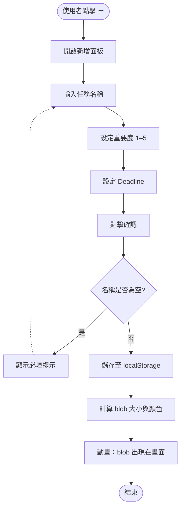
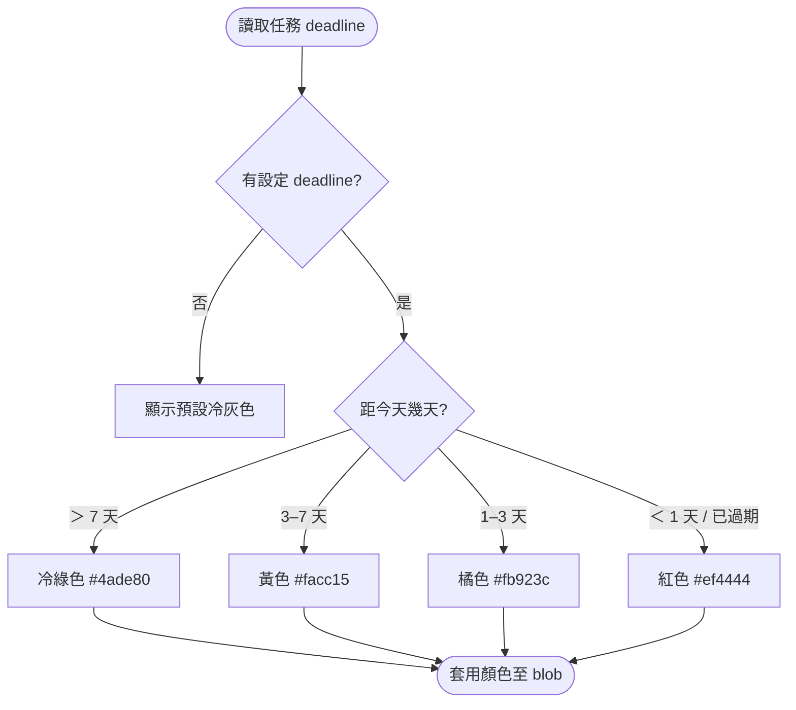
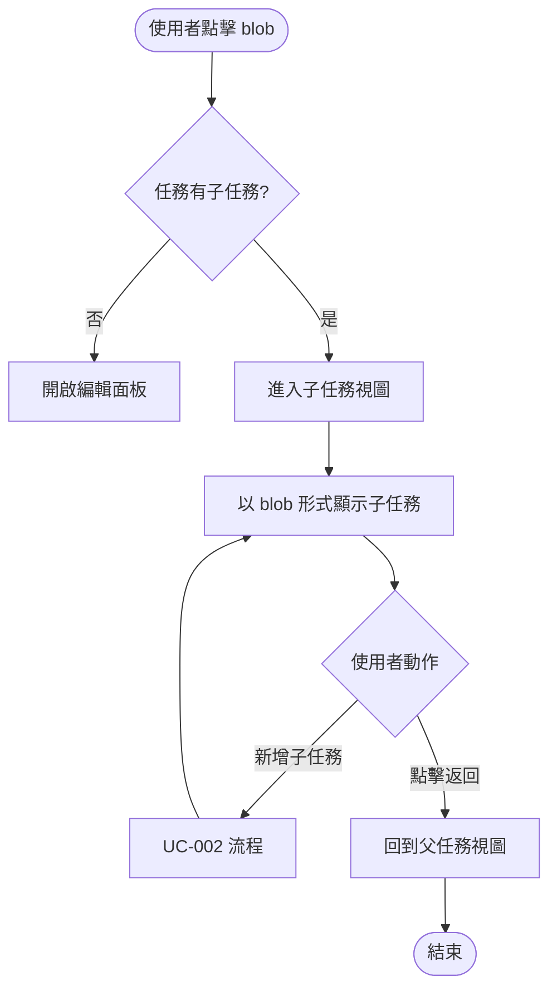

# Blob Todo 規格書

**版本**：v0.1
**建立日期**：2026-05-09
**最後更新**：2026-05-09
**作者**：soysen
**狀態**：草稿

---

## 1. 利害關係人地圖（Stakeholders）

| 姓名/角色 | 單位/職稱 | 角色 | 備註 |
| --------- | --------- | ---- | ---- |
| soysen | 個人使用者 / 開發者 | 決策者（Decider） | 唯一利害關係人 |

**核可協議：**
個人專案，決策者即使用者本人，規格書視使用者繼續開發行為為默認核可。

---

## 2. 專案概述（Executive Summary）

Blob Todo 是一個以有機 blob 造型視覺化任務的個人工具。每個任務以大小不一的 blob 呈現，大小由重要度決定，顏色由 deadline 接近程度決定，讓使用者打開頁面的瞬間即可直覺感知今天最重要、最緊迫的事。MVP 為單一 HTML 檔，長期目標為 Chrome New Tab 替換擴充功能。

---

## 3. 背景與動機（Background & Motivation）

**現況問題：**
使用者同時以腦袋和 Azure Planner 管理工作任務，缺乏「一眼看清全局輕重」的入口。傳統列表形式需要主動閱讀才能排序，無法在打開工具的瞬間直覺感知任務份量。

**機會或驅動力：**
Chrome New Tab 是每天必然觸及的頁面，若能在此放置視覺化任務全局圖，可以在不改變習慣的前提下降低認知負擔。市場上目前沒有結合有機視覺造型與重要度比例呈現的同類工具。

---

## 4. 目標與非目標（Goals & Non-goals）

### 目標（Goals）

- [ ] 打開頁面 < 2 秒即可看到所有任務的視覺全局圖
- [ ] Blob 大小能直觀反映重要度（重要度 5 的 blob 面積約為重要度 1 的 4 倍）
- [ ] Deadline 顏色系統讓使用者不需計算天數即可感知緊迫程度
- [ ] 新增/編輯/刪除任務操作不超過 3 步驟
- [ ] 資料在重整頁面後仍保留

### 非目標（Non-goals）

- 跨設備資料同步（原因：MVP 不需要，增加複雜度）
- AI 自動判斷重要度（原因：使用者明確要自己設定）
- Azure Planner 整合（原因：V2+ 才考慮）
- Chrome Extension 打包（原因：先驗證 UI 好用度，確認後再包裝）
- 多使用者協作（原因：純個人工具）

---

## 5. 使用者與情境（Users & Use Cases）

### 目標使用者

| 角色 | 描述 | 主要需求 |
| ---- | ---- | -------- |
| 個人工作者 | 同時管理多個輕重緩急任務，使用腦袋和 Azure Planner | 一眼看清今天最重要、最緊迫的事 |

### 使用情境（Use Cases）

**UC-001：查看任務全局圖**

- **角色**：個人工作者
- **前置條件**：已有至少一個任務
- **主要流程**：
  1. 打開頁面（或 Chrome New Tab）
  2. 看到所有任務以 blob 形式呈現在深色背景上
  3. 大 blob = 高重要度，紅色 blob = 快到 deadline
- **預期結果**：不需思考即可判斷從哪件事開始
- **例外情況**：無任務時顯示空狀態引導新增

**UC-002：新增任務**

- **角色**：個人工作者
- **前置條件**：無
- **主要流程**：
  1. 點擊「＋」按鈕
  2. 輸入任務名稱、設定重要度（1–5 滑桿）、設定 deadline（日期選擇器）
  3. 確認送出
  4. 新 blob 出現在畫面上，大小與顏色符合設定
- **預期結果**：任務立即以 blob 形式顯示
- **例外情況**：名稱為空時無法送出，提示必填

**UC-003：編輯任務**

- **角色**：個人工作者
- **前置條件**：已有至少一個任務
- **主要流程**：
  1. 長按或右鍵點擊 blob
  2. 開啟編輯面板，顯示現有資料
  3. 修改後確認
- **預期結果**：blob 大小/顏色即時更新
- **例外情況**：同 UC-002 的驗證規則

**UC-004：標記任務完成**

- **角色**：個人工作者
- **前置條件**：已有至少一個任務
- **主要流程**：
  1. 點擊 blob 上的完成按鈕（或特定手勢）
  2. Blob 視覺變為「已完成態」（去飽和 + 勾選 overlay）
- **預期結果**：完成的任務仍顯示但視覺淡化
- **例外情況**：無

**UC-005：查看與管理子任務**

- **角色**：個人工作者
- **前置條件**：任務存在
- **主要流程**：
  1. 點擊 blob（非長按）進入子任務視圖
  2. 看到子任務以較小的 blob 呈現
  3. 可在子任務視圖中新增/編輯/刪除子任務
  4. 點擊返回回到父視圖
- **預期結果**：子任務用相同視覺語言呈現
- **例外情況**：無子任務時顯示空狀態

---

## 6. 功能流程圖（Functional Flowcharts）

### FLOW-001：新增任務主流程



### FLOW-002：Deadline 顏色計算流程



### FLOW-003：查看子任務流程



---

## 7. 功能需求（Functional Requirements）

| ID | 需求描述 | 優先序 | 相依 | 備註 |
| ---- | ---- | ---- | ---- | ---- |
| REQ-F001 | 以 blob 形式視覺化所有任務，填充視窗空間 | 🔴 | - | |
| REQ-F002 | Blob 大小依重要度（1–5）等比縮放（最大:最小 ≈ 4:1） | 🔴 | REQ-F001 | |
| REQ-F003 | Deadline 顏色系統：冷綠→黃→橘→紅，依天數漸變 | 🔴 | REQ-F001 | |
| REQ-F004 | 新增任務（必填：名稱；選填：重要度、deadline） | 🔴 | - | |
| REQ-F005 | 編輯任務（名稱、重要度、deadline） | 🔴 | REQ-F004 | |
| REQ-F006 | 刪除任務（含確認提示） | 🔴 | REQ-F004 | |
| REQ-F007 | 標記任務完成（去飽和 + 勾選 overlay，仍保留在畫面） | 🔴 | REQ-F004 | |
| REQ-F008 | localStorage 持久化（新增/編輯/刪除/完成即時儲存） | 🔴 | REQ-F004 | |
| REQ-F009 | 視窗 resize 時自動重新計算 blob 位置（ResizeObserver） | 🟡 | REQ-F001 | |
| REQ-F010 | 1 層子任務：點擊 blob 進入子任務視圖，breadcrumb 返回 | 🟡 | REQ-F004 | |
| REQ-F011 | Blob 輕微漂浮動畫（CSS keyframe，緩慢晃動感） | 🟡 | REQ-F001 | |
| REQ-F012 | 空狀態引導：無任務時顯示新增提示 | 🟡 | REQ-F001 | |
| REQ-F013 | 無 deadline 的任務顯示預設冷灰色 blob | 🟢 | REQ-F003 | |

### 需求詳述

#### REQ-F002：Blob 大小比例

**描述**：重要度 1–5 對應 blob 面積，使用 `width/height = base * sqrt(weight)` 公式，確保面積而非半徑成比例。

**驗收標準**：
- [ ] 重要度 5 的 blob 面積約為重要度 1 的 5 倍（視覺可辨識差異）
- [ ] 重要度相同的任務，blob 大小相同

#### REQ-F003：Deadline 顏色系統

**描述**：根據距今天的天數（不含時間）決定 blob 顏色。

**驗收標準**：
- [ ] > 7 天：冷綠 `hsl(142, 70%, 45%)`
- [ ] 3–7 天：黃 `hsl(45, 95%, 55%)`
- [ ] 1–3 天：橘 `hsl(25, 95%, 58%)`
- [ ] < 1 天 / 已過期：紅 `hsl(0, 85%, 60%)`
- [ ] 無 deadline：冷灰 `hsl(220, 10%, 40%)`

#### REQ-F004：新增任務

**描述**：點擊「＋」按鈕開啟 modal，輸入任務資訊後儲存。

**驗收標準**：
- [ ] 名稱為空時無法送出，顯示錯誤訊息
- [ ] 重要度預設為 3（中等）
- [ ] deadline 為選填，不填時 blob 顯示預設灰色
- [ ] 送出後 modal 關閉，blob 以動畫出現

#### REQ-F007：標記完成

**描述**：完成的任務保留在畫面並反灰，直到使用者手動刪除。不自動隱藏。

**驗收標準**：
- [ ] 完成態：blob 顏色轉為灰色（`hsl(220, 8%, 35%)`），降低存在感
- [ ] 完成態的 blob 仍佔據空間，不消失、不縮小
- [ ] 完成態顯示勾選 overlay（白色半透明 ✓）
- [ ] 可取消完成狀態（再次點擊完成按鈕切換回未完成）
- [ ] 刪除是獨立操作（透過編輯 Modal 的刪除按鈕）

#### REQ-F010：子任務視圖

**描述**：每個任務最多 1 層子任務，點擊 blob 進入子任務視圖。子任務**不需要**獨立的重要度和 deadline。父任務 blob 上顯示最近一筆未完成子任務的名稱作為提示。

**驗收標準**：
- [ ] 點擊 blob 進入子任務視圖，顯示 breadcrumb（如：「所有任務 > 專案 A」）
- [ ] 子任務視圖使用相同的 blob 視覺語言
- [ ] 子任務**只有**名稱欄位（無重要度、無 deadline）
- [ ] 父任務 blob 上以小字顯示「最近一筆未完成子任務名稱」（子任務存在時才顯示）
- [ ] breadcrumb 點擊可返回上層

---

## 8. 非功能需求（Non-functional Requirements）

| ID | 類型 | 需求描述 | 指標 | 優先序 |
| ---- | ---- | ---- | ---- | ---- |
| REQ-NF001 | 效能 | 頁面首次可互動時間 | < 1 秒（無網路請求） | 🔴 |
| REQ-NF002 | 相容性 | 瀏覽器支援 | Chrome 最新版（含 Extension 目標） | 🔴 |
| REQ-NF003 | 可維護性 | 單一檔案 MVP | 全部邏輯在一個 `.html` 檔 | 🔴 |
| REQ-NF004 | 無障礙 | 基本鍵盤操作 | Tab 可遍歷所有互動元素 | 🟡 |
| REQ-NF005 | 響應式 | 視窗大小自適應 | 640px–2560px 皆正常顯示 | 🟡 |

---

## 9. 技術考量（Technical Considerations）

### 技術棧

| 層次 | 技術選項 | 建議 | 理由 |
| ---- | ---- | ---- | ---- |
| 結構 | HTML5 | 單一 `.html` | MVP 無框架依賴，方便後續打包為 Chrome Extension |
| 樣式 | Vanilla CSS | CSS custom properties + keyframe | 無需建構工具，blob 造型用 `border-radius` 多值實現 |
| 邏輯 | Vanilla JS（ES2022） | `<script type="module">` | 現代語法，無需轉譯 |
| 持久化 | localStorage | JSON 序列化 | 純前端，無後端依賴 |
| 版面計算 | 自製 pack 演算法 | 圓形 bin packing（近似） | Blob 非矩形，用圓形碰撞簡化計算 |
| 動畫 | CSS keyframe | `@keyframes float` | GPU 加速，效能佳 |

### Blob 造型技術

使用 CSS `border-radius` 八值語法製造有機感：

```css
.blob {
  border-radius: 60% 40% 30% 70% / 60% 30% 70% 40%;
  /* 每個 blob 隨機生成不同的 border-radius 值 */
}
```

每個任務在建立時隨機生成一組 border-radius 值並儲存，確保同一任務每次顯示形狀相同。

### Blob 位置排列策略

採用**圓形近似 + 排斥力模擬**：
1. 依重要度計算每個 blob 的半徑
2. 初始位置：視窗中心附近隨機分佈
3. 執行簡單排斥力模擬（避免重疊）
4. 最終靜止位置儲存至 localStorage

### 整合與相依

- **外部系統**：無（MVP 完全離線）
- **內部相依**：無
- **資料遷移**：無（從零開始）

### 技術限制

- Chrome Extension 的 New Tab 頁面不允許 inline script，未來打包時需調整 CSP
- 圓形 bin packing 是 NP-hard 問題，本 MVP 使用近似演算法，結果非最優解但視覺上可接受
- localStorage 容量上限 5MB，任務數量在數百筆以內不會有問題

---

## 10. 里程碑規劃（Milestones）

| 里程碑 | 目標 | 包含功能 | 預計完成 |
| ---- | ---- | ---- | ---- |
| M1 - MVP | 核心視覺化可用 | REQ-F001~F008 + REQ-F012 | [待確認] |
| M2 - 子任務 | 完整功能 | REQ-F009~F011 + REQ-F013 | [待確認] |
| M3 - Chrome Extension | 打包上架 | 所有功能 + CSP 調整 + Extension manifest | [待確認] |

---

## 11. 風險與假設（Risks & Assumptions）

### 假設

- 使用者每天會主動打開頁面（M3 前靠習慣，M3 後靠 Chrome New Tab 觸發）
- localStorage 不跨裝置在 MVP 階段可接受
- Blob 不填滿整個視窗的視覺效果（有背景空隙）使用者已接受

### 風險

| 風險描述 | 影響 | 可能性 | 緩解策略 |
| ---- | ---- | ---- | ---- |
| Blob 排列在任務多時過於擁擠，視覺混亂 | 中 | 中 | 限制 MVP 最多顯示 12 個頂層任務，超過時提示歸檔 |
| 使用者不習慣有機 blob，偏好更結構化的排列 | 中 | 低 | M2 加入視圖切換選項（blob / grid） |
| localStorage 在 Chrome Extension 環境需改為 `chrome.storage.local` | 低 | 高 | M3 打包時統一替換，API 相似度高 |
| 圓形 bin packing 演算法在極端大小差異時排列不佳 | 低 | 中 | 加入邊界 padding 和最小 blob 尺寸保護 |

---

## 12. 開放性問題（Open Questions）

| # | 問題 | 負責人 | 狀態 | 決策 |
| --- | ---- | ---- | ---- | ---- |
| Q1 | 子任務是否需要獨立的 deadline 和重要度？ | soysen | ✅ 已解決 | 不需要。父 blob 顯示最近一筆未完成子任務名稱 |
| Q2 | 「完成」的任務要隱藏還是保留？ | soysen | ✅ 已解決 | 保留反灰，直到手動刪除 |
| Q3 | 頂層任務顯示上限是多少？ | soysen | ✅ 已解決 | 無上限，工作量少不需要限制 |
| Q4 | 重要度使用 1–5 滑桿還是 1–10？ | soysen | ✅ 已解決 | 使用 1–5 滑桿 |

---

## 13. 需求衝突決策記錄（Conflict Resolution Log）

| # | 衝突描述 | 選項 A | 選項 B | 決策結果 | 決策者 | 決策日期 | 理由 |
| --- | ---- | ---- | ---- | ---- | ---- | ---- | ---- |
| C1 | 視覺填滿視窗 vs. 有機 blob 造型 | Treemap/Voronoi（填滿，較精確） | Blob 泡泡（有機，有空隙） | 選 B：Blob 泡泡 | soysen | 2026-05-09 | 使用者優先有機感，接受背景有空隙的 tradeoff |

---

## 附錄

### 相關文件

- 概念文件：[docs/ideas/blob-todo.md](../ideas/treemap-todo.md)

### 修訂記錄

| 版本 | 日期 | 修改人 | 變更說明 |
| ---- | ---- | ---- | ---- |
| v0.1 | 2026-05-09 | soysen | 初稿建立，由 idea-refine 產出轉換 |
