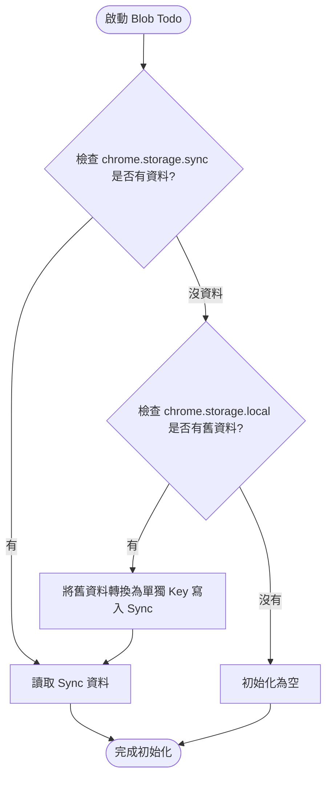

# Blob Todo 跨裝置同步 (Chrome Sync) 規格書

**版本**：v0.1  
**建立日期**：2026-06-04
**最後更新**：2026-06-04
**作者**：Antigravity  
**狀態**：草稿

---

## 1. 利害關係人地圖（Stakeholders）

| 姓名/角色 | 單位/職稱 | 角色 | 聯絡方式 |
| --------- | --------- | ---- | -------- |
| User | 專案擁有者 | 決策者（Decider） | - |

---

## 2. 專案概述（Executive Summary）

將 Blob Todo 擴充套件的任務儲存機制從原本的 `chrome.storage.local` 升級為 `chrome.storage.sync`，讓使用者在不同裝置上登入同一個 Google 帳號的 Chrome 瀏覽器時，能夠自動同步待辦事項。

---

## 3. 背景與動機（Background & Motivation）

**現況問題：**
Blob Todo 目前將所有任務資料以單一陣列的格式儲存在 `chrome.storage.local` (或 `localStorage`)，無法跨裝置同步。當使用者在公司與家裡的電腦切換時，必須重複輸入或面臨資料不一致的痛點。

**機會或驅動力：**
由於 Blob Todo 本身已經是一個 Chrome Extension，使用 Chrome 內建的 `chrome.storage.sync` API 是達成跨裝置同步成本最低且使用者體驗最無縫的方案。

---

## 4. 目標與非目標（Goals & Non-goals）

### 目標（Goals）

- [x] 將儲存機制替換為 `chrome.storage.sync`。
- [x] 重構 `TaskStore` 以避免超過單一 Key 的 8KB 限制（將任務獨立儲存）。
- [x] 確保舊版 `chrome.storage.local` 的資料可以平滑轉移至 `chrome.storage.sync`。

### 非目標（Non-goals）

- 跨瀏覽器同步（例如同步到 Safari 或 Firefox，原因：不在 Chrome Sync 支援範圍）。
- 離線優先且複雜的衝突解決機制（原因：保持輕量化，直接以最新寫入的時間戳為準或依賴 Chrome Sync 的內建機制）。

---

## 5. 使用者與情境（Users & Use Cases）

### 目標使用者

| 角色     | 描述   | 主要需求 |
| -------- | ------ | -------- |
| 多裝置使用者 | 在多台電腦工作 | 在任何電腦打開 Blob Todo 都能看到最新的任務 |

### 使用情境（Use Cases）

**UC-001：跨裝置新增與同步任務**
- **角色**：多裝置使用者
- **前置條件**：使用者在兩台電腦上的 Chrome 皆登入同一個 Google 帳號。
- **主要流程**：
  1. 使用者在電腦 A 的 Blob Todo 新增一個任務。
  2. Blob Todo 將新任務以獨立 Key 寫入 `chrome.storage.sync`。
  3. 電腦 B 開啟 Blob Todo，自動從 `chrome.storage.sync` 讀取並渲染。
- **預期結果**：電腦 B 能顯示與電腦 A 相同的任務。
- **例外情況**：使用者在電腦 A 沒有網路連線。處理：寫入 local cache 且 Chrome 會在有網路時自動同步。

---

## 6. 功能流程圖（Functional Flowcharts）

### FLOW-001：資料讀取與轉移流程

---

## 7. 功能需求（Functional Requirements）

| ID       | 需求描述       | 優先序 | 相依     | 備註     |
| -------- | -------------- | ------ | -------- | -------- |
| REQ-F001 | 將儲存 API 切換為 `chrome.storage.sync` | 🔴 | - | |
| REQ-F002 | 將 `TaskStore` 改為每個任務獨立 Key 儲存，避免 8KB 限制 | 🔴 | REQ-F001 | |
| REQ-F003 | 實作舊資料無縫轉移機制 | 🔴 | REQ-F002 | 自動從 local 讀取並寫入 sync |
| REQ-F004 | 監聽 `chrome.storage.onChanged` 事件即時更新 UI | 🟡 | REQ-F001 | 若多個分頁開啟時可即時同步 |

---

## 8. 非功能需求（Non-functional Requirements）

| ID        | 類型     | 需求描述     | 指標          | 優先序 |
| --------- | -------- | ------------ | ------------- | ------ |
| REQ-NF001 | 擴充性 | 避免 Chrome Sync Quota 錯誤 | 任務數量上限逼近 512 個時給予警告 | 🔴 |
| REQ-NF002 | 效能 | 初始載入效能不應明顯退化 | 讀取時間 < 500ms | 🟡 |

---

## 9. 技術考量（Technical Considerations）

### 技術棧建議

- **儲存層**：`chrome.storage.sync`
- **資料結構設計**：
  - 為了避開單一 item 8KB 限制，原本 `tasks: [...]` 將拆成：
    - `blob-todo-meta`: 存放所有 taskId 的列表（Array of strings）
    - `blob-todo-task-[id]`: 獨立存放該任務的詳細資料
    - `blob-todo-history`: 歷史紀錄可以考慮縮減保存筆數以節省空間。

### 技術限制
- `chrome.storage.sync` 的總量上限為 100KB。
- 單一 item 上限為 8KB。
- 總 item 數量上限為 512。

---

## 10. 里程碑規劃（Milestones）

| 里程碑        | 目標           | 包含功能            | 預計完成 |
| ------------- | -------------- | ------------------- | -------- |
| M1 - Refactor | 改寫 TaskStore | 獨立 Key 儲存、讀寫邏輯更新 | TBD |
| M2 - Migration| 舊資料轉移腳本 | 自動偵測 local 並搬移至 sync | TBD |
| M3 - Launch   | 正式更新       | 部署新版擴充套件 | TBD |

---

## 11. 風險與假設（Risks & Assumptions）

### 假設
- 使用者的待辦事項總數量不會超過 Chrome Sync 的 512 個 Key 上限（保留部分 Key 給 Meta 與 History，可用約 450 個任務）。

### 風險
| 風險描述 | 影響 | 可能性 | 緩解策略 |
| -------- | ---- | ------ | -------- |
| 任務數超過 Chrome Sync 的 Item 數量限制 (512) | 高 | 低 | 在任務數達到 400 個時於 UI 提示使用者刪除或封存舊任務。 |

---

## 12. 開放性問題（Open Questions）

| #   | 問題       | 負責人   | 期限   | 狀態      |
| --- | ---------- | -------- | ------ | --------- |
| Q1  | 當任務超過 400 個時，是否要實作 Chunk 打包機制來避開 512 Items 限制？（目前建議先只做數量限制警告，以保持簡單） | User / AI | - | 🔍 待討論 |

---
