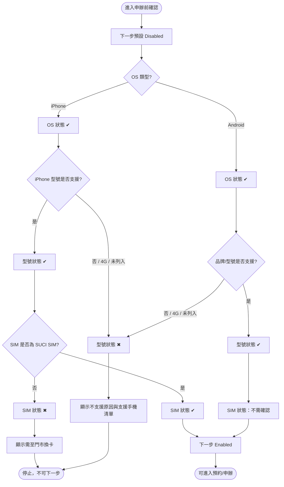
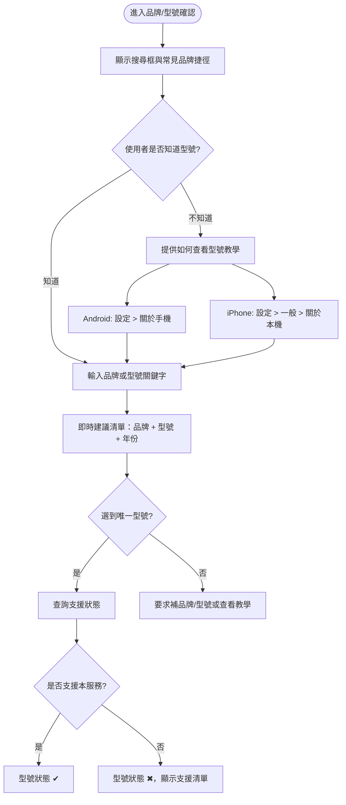
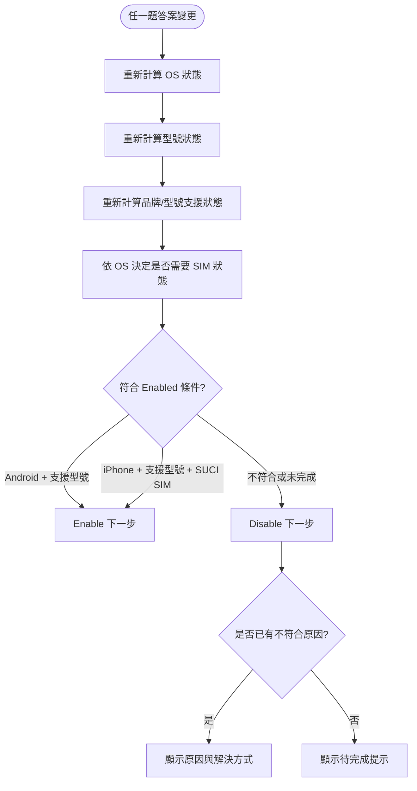

# 裝置相容性確認流程工程規格

**版本**：v0.2  
**建立日期**：2026-07-21  
**最後更新**：2026-07-21  
**作者**：GitHub Copilot  
**狀態**：草稿

---

## 1. 利害關係人地圖（Stakeholders）

| 姓名/角色           | 單位/職稱 | 角色                | 聯絡方式 |
| ------------------- | --------- | ------------------- | -------- |
| 部門負責人          | [待確認]  | 決策者（Decider）   | [待確認] |
| 產品/業務負責人     | [待確認]  | 諮詢者（Consulted） | [待確認] |
| 前端/後端工程負責人 | [待確認]  | 諮詢者（Consulted） | [待確認] |
| 門市營運/客服負責人 | [待確認]  | 諮詢者（Consulted） | [待確認] |
| 申辦流程使用者      | 客戶      | 知情者（Informed）  | N/A      |

**核可協議：**  
此規格書需由「部門負責人」確認後，狀態方可更新為「已確認」。核可代表對 Goals、Non-goals、阻擋條件與 🔴 必要需求優先序的認可。

---

## 2. 專案概述（Executive Summary）

本功能在 5G+ 優先通行服務申辦前，提供最少步驟的裝置相容性確認流程，避免客戶完成申辦後因手機型號或 SIM 條件不符而無法使用服務。流程以「先辨識 OS，再用品牌/型號確認是否為支援機型，僅 iPhone 追問 SUCI SIM」為核心，符合條件才啟用下一步預約或申辦。

---

## 3. 背景與動機（Background & Motivation）

**現況問題：**

- 客戶若在申辦後才發現手機或 SIM 不支援，會造成服務啟用失敗、客服成本與門市補件成本。
- 裝置相容性涉及 OS、品牌、型號、上市年份、5G 支援與 SIM 條件，若要求使用者自行判斷 4G/5G，容易出錯。
- 並非所有 Android 5G 手機都支援本服務；初步假設約 2020 年後機型較可能支援，但仍需以支援型號資料為準。
- iPhone 需確認 SUCI SIM；非 SUCI SIM 客戶應在申辦前被導引至門市換卡。

**機會或驅動力：**

- 透過漸進式問題與即時狀態，降低使用者完成確認的步驟與挫折。
- 在不符合條件時立即提供原因與解決方式，減少無效申辦。
- 未來可透過手機型號搜尋、SIM 自動判斷或登入後資料帶入，進一步縮短流程。

---

## 4. 目標與非目標（Goals & Non-goals）

### 目標（Goals）

- [ ] 使用者能以最少必要互動完成相容性確認：OS、品牌/型號、iPhone SIM 類型。
- [ ] 符合條件時才啟用下一步預約/申辦入口。
- [ ] 不符合條件時立即顯示明確原因與可執行解法。
- [ ] 每回答一題即時更新檢查狀態：OS、品牌/型號、SIM。
- [ ] 提供可擴充到手機型號查詢與 SIM 自動判斷的工程資料結構。

### 非目標（Non-goals）

- 本版不實作完整手機型號資料庫維運流程（原因：需要資料來源、更新頻率與責任單位先確認）。
- 本版不直接完成門市換卡預約或庫存查詢整合（原因：屬於後續門市系統整合）。
- 本版不承諾可由瀏覽器自動讀取 SIM 是否為 SUCI SIM（原因：一般 Web 環境無法直接讀取 SIM 卡安全資訊）。
- 本版不處理申辦後開通、帳務或資費檢核（原因：本流程只負責申辦前裝置相容性門檻）。

---

## 5. 使用者與情境（Users & Use Cases）

### 目標使用者

| 角色          | 描述                              | 主要需求                            |
| ------------- | --------------------------------- | ----------------------------------- |
| 申辦客戶      | 想申辦 5G+ 優先通行服務的手機用戶 | 快速知道自己的手機與 SIM 是否可申辦 |
| 客服/門市人員 | 協助客戶排除無法申辦原因          | 能用一致流程解釋阻擋原因與下一步    |
| 產品/營運人員 | 維護服務申辦門檻與轉換率          | 降低不符合資格的申辦與後續客訴      |

### 使用情境（Use Cases）

**UC-001：Android 支援型號完成相容性確認**

- **角色**：申辦客戶
- **前置條件**：客戶進入 5G+ 優先通行服務申辦流程。
- **主要流程**：
  1. 系統預設下一步按鈕為 Disabled。
  2. 客戶選擇 OS：Android。
  3. 系統詢問品牌與型號，並提供搜尋、熱門品牌捷徑與不確定協助。
  4. 客戶選擇支援型號。
  5. 系統顯示 OS 與型號狀態為 ✔，SIM 狀態標示為「不需確認」。
  6. 系統啟用下一步。
- **預期結果**：客戶可進入預約/申辦流程。
- **例外情況**：若客戶選擇不支援型號或 4G 型號，系統立即停用下一步並顯示支援手機清單入口。

**UC-002：iPhone 支援型號 + SUCI SIM 完成相容性確認**

- **角色**：申辦客戶
- **前置條件**：客戶進入 5G+ 優先通行服務申辦流程。
- **主要流程**：
  1. 客戶選擇 OS：iPhone。
  2. 系統詢問 iPhone 型號，並提供快速選型或搜尋。
  3. 客戶選擇支援型號。
  4. 系統顯示 SIM 確認題。
  5. 客戶選擇 SUCI SIM。
  6. 系統顯示 OS、型號、SIM 皆為 ✔。
  7. 系統啟用下一步。
- **預期結果**：客戶可進入預約/申辦流程。
- **例外情況**：若客戶選擇非 SUCI SIM，系統停用下一步並導引門市換卡。

**UC-003：不符合條件時立即阻擋並導引**

- **角色**：申辦客戶
- **前置條件**：客戶回答任一相容性問題。
- **主要流程**：
  1. 客戶選擇不支援型號、4G 型號，或選擇 iPhone 且 SIM 非 SUCI。
  2. 系統即時顯示該項狀態為 ✖。
  3. 系統停用下一步。
  4. 系統顯示阻擋原因與解決方式。
- **預期結果**：客戶知道不可申辦的原因，以及下一個可執行動作。
- **例外情況**：若客戶修改答案後符合條件，狀態與下一步按鈕需立即重新計算。

---

## 6. 功能流程圖（Functional Flowcharts）

### FLOW-001：最少步驟相容性確認主流程



### FLOW-002：快速確認與未知型號輔助流程



### FLOW-003：狀態即時計算流程



---

## 7. 功能需求（Functional Requirements）

| ID       | 需求描述                                                                                                      | 優先序 | 相依                         | 備註                                    |
| -------- | ------------------------------------------------------------------------------------------------------------- | ------ | ---------------------------- | --------------------------------------- |
| REQ-F001 | 系統進入相容性確認頁時，下一步按鈕預設為 Disabled。                                                           | 🔴     | -                            | 必須防止未確認即申辦                    |
| REQ-F002 | 系統必須先詢問 OS，並至少包含 Android 與 iPhone。                                                             | 🔴     | REQ-F001                     | OS 會決定後續型號與 SIM 題目            |
| REQ-F003 | 系統必須在 OS 確認後要求確認手機品牌與型號。                                                                  | 🔴     | REQ-F002                     | 因不是每個 5G 手機都支援                |
| REQ-F004 | 若使用者選擇不支援型號、4G 型號或未列入支援清單的型號，系統必須停止流程、顯示支援手機清單入口，且不可下一步。 | 🔴     | REQ-F003                     |                                         |
| REQ-F005 | 系統必須提供快速型號確認機制：搜尋、熱門品牌捷徑、型號查看教學。                                              | 🔴     | REQ-F003                     | 型號確認方式未知時的 UX 核心            |
| REQ-F006 | 若 OS 為 Android，且型號支援本服務，完成裝置確認後即可啟用下一步。                                            | 🔴     | REQ-F003                     | Android 不需追問 SUCI SIM，但需型號支援 |
| REQ-F007 | 若 OS 為 iPhone，且型號支援本服務，系統必須要求確認 SIM 是否為 SUCI SIM。                                     | 🔴     | REQ-F003                     |                                         |
| REQ-F008 | 若 iPhone 使用者選擇支援型號且 SUCI SIM，系統必須啟用下一步。                                                 | 🔴     | REQ-F007                     |                                         |
| REQ-F009 | 若 iPhone 使用者選擇非 SUCI SIM，系統必須停止流程、導引至門市換卡，且不可下一步。                             | 🔴     | REQ-F007                     |                                         |
| REQ-F010 | 系統必須在每回答一題後即時更新 OS、品牌/型號、SIM 的檢查狀態。                                                | 🔴     | REQ-F002, REQ-F003, REQ-F007 | 狀態值需支援 ✔、✖、待確認、不需確認     |
| REQ-F011 | 系統必須依單一 eligibility rule 計算下一步是否 Enabled。                                                      | 🔴     | REQ-F010                     | Enabled 條件需包含支援型號              |
| REQ-F012 | 不符合條件時，系統必須立即顯示阻擋原因與解決方式。                                                            | 🔴     | REQ-F004, REQ-F009           |                                         |
| REQ-F013 | 系統應提供手機型號搜尋/選擇作為主要確認方式，避免要求使用者自行判斷 4G/5G。                                   | 🟡     | REQ-F003                     | 可降低自判錯誤                          |
| REQ-F014 | 系統應提供「我不知道 SIM 類型」的協助入口。                                                                   | 🟡     | REQ-F007                     | 可導向查詢教學、客服或門市              |
| REQ-F015 | 系統可在登入狀態下帶入既有門號/SIM 資料以預填答案。                                                           | 🟢     | REQ-F011                     | 需確認資料可用性與隱私規範              |
| REQ-F016 | 系統應提供「我不知道手機型號」的協助入口。                                                                    | 🟡     | REQ-F005                     | 需依 OS 顯示不同查看路徑                |

### 需求詳述

#### REQ-F011：Eligibility Rule

**描述**：  
系統必須用一致規則決定下一步是否可點擊，避免 UI 顯示與實際申辦資格不同步。

**規則**：

```text
nextStepEnabled =
  modelSupport == "supported" AND (
    os == "Android" OR
    (os == "iPhone" AND simType == "SUCI")
  )
```

**驗收標準**：

- [ ] 未回答任何問題時，下一步為 Disabled。
- [ ] 不支援型號、4G 型號或未列入支援清單型號，下一步為 Disabled。
- [ ] Android + 支援型號，下一步為 Enabled。
- [ ] iPhone + 支援型號 + SUCI SIM，下一步為 Enabled。
- [ ] iPhone + 支援型號 + 非 SUCI SIM，下一步為 Disabled。
- [ ] 使用者修改任一答案後，下一步狀態需立即重新計算。

#### REQ-F012：阻擋原因與解決方式

**描述**：  
不符合條件時，不只顯示不可申辦，也需提供可行下一步。

**建議文案規則**：

| 條件                    | 狀態   | 原因                                                              | 解決方式                                   |
| ----------------------- | ------ | ----------------------------------------------------------------- | ------------------------------------------ |
| 不支援型號 / 非 5G 型號 | 型號 ✖ | 此服務需使用支援 5G+ 優先通行服務的手機；並非所有 5G 手機都支援。 | 查看支援手機清單，或更換支援型號後再申辦。 |
| iPhone + 非 SUCI SIM    | SIM ✖  | 你的 SIM 尚不支援此服務所需的 SUCI SIM 條件。                     | 請攜帶證件至門市換卡後再申辦。             |
| 未完成必要問題          | 待確認 | 尚未完成相容性確認。                                              | 請完成目前顯示的問題。                     |

---

## 8. 非功能需求（Non-functional Requirements）

| ID        | 類型     | 需求描述                                                           | 指標                                                | 優先序 |
| --------- | -------- | ------------------------------------------------------------------ | --------------------------------------------------- | ------ |
| REQ-NF001 | 可用性   | 問題呈現需採漸進式揭露，避免一次要求回答所有欄位。                 | Android 一般路徑最多 2 題，iPhone 一般路徑最多 3 題 | 🔴     |
| REQ-NF002 | 回饋速度 | 回答任一題後，狀態與下一步按鈕需即時更新。                         | UI 更新 < 100ms（前端狀態計算）                     | 🔴     |
| REQ-NF003 | 可理解性 | 阻擋原因需使用使用者可理解語言，不只呈現代碼或內部術語。           | 每個阻擋條件都有原因 + 解法                         | 🔴     |
| REQ-NF004 | 無障礙   | 狀態不可只靠顏色辨識。                                             | 狀態需同時有文字、圖示與 aria 狀態                  | 🟡     |
| REQ-NF005 | 可維護性 | eligibility rule 應集中管理，避免散落在多個 UI handler。           | 單一 rule function 或設定表                         | 🔴     |
| REQ-NF006 | 隱私     | 若使用登入門號/SIM 資料預填，不得在前端暴露不必要的 SIM 識別資料。 | 僅回傳判斷結果或遮罩資料                            | 🟡     |

---

## 9. 技術考量（Technical Considerations）

### 技術棧建議

| 層次     | 技術選項                             | 建議                                  | 理由                                       |
| -------- | ------------------------------------ | ------------------------------------- | ------------------------------------------ |
| 前端     | 既有申辦流程前端框架                 | 沿用既有框架                          | 本功能是申辦流程前置檢核，應避免引入新框架 |
| 前端狀態 | Rule function / finite state mapping | 建議採用純函式 eligibility calculator | 易測試、可重用於表單與按鈕狀態             |
| 後端     | 既有客戶/門號服務 API                | 若要預填 SIM 結果才需要               | 純問答版可先不依賴後端                     |
| 資料     | 支援手機清單 / SIM 判斷資料          | 建議以可版本化設定或 API 供應         | 避免硬編碼支援型號與換卡資訊               |

### 簡化流程建議

1. **合併 4G/5G 與品牌/型號確認**：不要先問「是否 5G」再問型號，因為型號資料可同時判斷 4G/5G 與是否支援本服務。這能減少一題，也避免使用者誤判自己手機是不是 5G。
2. **先問 OS，再問型號**：OS 是低成本二選一，可立即決定後續型號清單與 SIM 題目。先問 OS 可以縮小搜尋範圍，讓 Android 使用者不看到 iPhone SIM 問題。
3. **型號確認採搜尋優先，而非下拉選單優先**：使用者通常記得品牌或系列名稱，但不一定知道完整型號。搜尋框應支援品牌、系列、型號片段與上市年份提示。
4. **提供熱門品牌捷徑**：在搜尋框下方顯示 Samsung、Google、Sony、OPPO、vivo、小米、iPhone 等熱門入口，降低從零輸入的負擔。
5. **提供「我不知道型號」的短路徑**：依 OS 顯示查看方式。Android 顯示「設定 > 關於手機」；iPhone 顯示「設定 > 一般 > 關於本機」。不要把完整教學展開成長文，先用一行提示加可展開截圖/說明。
6. **對不確定結果提供保守阻擋與下一步**：若型號未列入資料庫，預設不可下一步，並提供支援清單、客服或門市確認入口，避免錯誤放行。
7. **登入後預填**（第三階段）：若系統可取得門號對應 SIM 類型或歷史裝置資料，只顯示「系統判定」結果與修正入口，不要求使用者重複回答。
8. **狀態條固定可見**：使用 OS、型號、SIM 三項狀態讓使用者知道目前卡在哪一步。

### 可合併流程與理由

| 原流程                             | 建議                         | 原因                                                                                     | 影響                                       |
| ---------------------------------- | ---------------------------- | ---------------------------------------------------------------------------------------- | ------------------------------------------ |
| 先問 4G/5G，再問 OS，再問品牌/型號 | 合併為先問 OS，再問品牌/型號 | 品牌/型號資料可直接判斷 4G/5G 與支援狀態，4G/5G 自判不影響最終 eligibility，且容易誤答。 | 減少一題；降低錯誤放行或錯誤阻擋。         |
| Android 5G 直接通過                | Android 也需型號支援確認     | 不是所有 Android 5G 手機都支援，單看 5G 不足以決定結果。                                 | Android 路徑多一個型號確認，但結果更準確。 |
| iPhone 先問 SIM，再確認型號        | 先確認 iPhone 型號，再問 SIM | 若型號不支援，SIM 題不會改變結果，應先阻擋以避免多問。                                   | 減少不必要 SIM 題目。                      |
| 全部使用者都看到 SIM 狀態          | Android 顯示 SIM「不需確認」 | Android 路徑不需要 SIM 條件，顯示不需確認即可避免困惑。                                  | 狀態完整但不增加題目。                     |

### 手機型號確認 UX 方案

| 方案              | 描述                                                         | 優點                           | 風險/限制                        | 建議階段          |
| ----------------- | ------------------------------------------------------------ | ------------------------------ | -------------------------------- | ----------------- |
| 快速搜尋          | 單一輸入框支援品牌、系列、型號片段，結果顯示年份與支援狀態。 | 步驟最少，適合大多數使用者。   | 需要可靠型號資料與同義詞處理。   | M1/M2             |
| 熱門品牌捷徑      | 先點品牌，再選常見系列/型號。                                | 對不知道完整型號的使用者友善。 | 清單過長會拖慢流程。             | M1                |
| 不知道型號教學    | 依 OS 顯示查看型號路徑。                                     | 降低放棄率。                   | 教學需保持精簡，避免打斷申辦。   | M1                |
| 登入後預填        | 依門號、歷史裝置或 SIM 資料預填判斷。                        | 最快，幾乎無需回答。           | 需確認資料準確性、授權與隱私。   | M3                |
| 掃描/上傳截圖辨識 | 讓使用者上傳「關於本機」截圖，由系統辨識型號。               | 可幫助不會找型號的使用者。     | 隱私、OCR 準確率、開發成本較高。 | M4 / Nice to have |

### 建議資料模型

```ts
type OperatingSystem = "unknown" | "Android" | "iPhone"
type ModelSupport = "unknown" | "supported" | "unsupported" | "not_listed"
type SimType = "unknown" | "SUCI" | "non_SUCI" | "not_required"
type CheckStatus = "pending" | "pass" | "fail" | "not_required"

interface CompatibilityAnswers {
	os: OperatingSystem
	brand?: string
	modelName?: string
	modelSupport: ModelSupport
	simType: SimType
}

interface CompatibilityResult {
	nextStepEnabled: boolean
	osStatus: CheckStatus
	modelStatus: CheckStatus
	simStatus: CheckStatus
	blockingReason?: "UNSUPPORTED_MODEL" | "MODEL_NOT_LISTED" | "NON_SUCI_SIM" | "INCOMPLETE"
	resolutionAction?: "VIEW_SUPPORTED_DEVICES" | "CONTACT_SUPPORT" | "VISIT_STORE_FOR_SIM" | "CONTINUE_ANSWERING"
}
```

### 整合與相依

- **外部系統**：支援手機型號清單來源、門市資訊頁或換卡導引頁、[待確認] 是否有 SIM 類型查詢 API。
- **內部相依**：既有申辦流程的下一步控制、表單狀態管理、門號登入資料（若要預填）。
- **資料遷移**：MVP 需要最小可用支援型號資料；若擴充為完整手機型號資料庫，需建立資料更新與版本控管流程。

### 技術限制

- 一般 Web 頁面無法直接讀取手機 SIM 是否為 SUCI SIM，除非後端已有門號/SIM 資料可查。
- 手機型號是否支援 5G 需依賴可信資料來源，且需處理同型號不同市場版本差異。
- 約 2020 年後機型較可能支援僅能作為 UX 提示，不可作為最終放行規則；最終仍需以支援型號資料為準。
- Android 不需 SUCI SIM 是目前規則；若未來 Android 也需 SIM 條件，eligibility rule 需改版並重新核可。

---

## 10. 里程碑規劃（Milestones）

| 里程碑          | 目標                     | 包含功能                                                           | 預計完成 |
| --------------- | ------------------------ | ------------------------------------------------------------------ | -------- |
| M0 - 規格確認   | 決策者確認流程與阻擋條件 | Goals、Non-goals、REQ-F001 至 REQ-F016                             | [待確認] |
| M1 - MVP        | 問答與下一步控制可運作   | OS、品牌/型號、SIM 問答、即時狀態、阻擋文案                        | [待確認] |
| M2 - UX 強化    | 降低自判錯誤與客服成本   | 搜尋同義詞、熱門品牌捷徑、支援手機清單入口、「不知道 SIM」協助入口 | [待確認] |
| M3 - 自動化判斷 | 減少手動回答             | 型號搜尋、登入後 SIM 判斷預填                                      | [待確認] |

---

## 11. 風險與假設（Risks & Assumptions）

### 假設

- Android 手機在本次流程中不需確認 SUCI SIM，但必須是支援型號才可進入下一步。
- iPhone 是否可申辦取決於是否使用 SUCI SIM。
- 「支援手機型號清單」已有或可由業務/技術單位提供。
- 使用者可理解或可透過輔助內容判斷自己的 SIM 是否為 SUCI SIM。

### 風險

| 風險描述                             | 影響 | 可能性 | 緩解策略                                                   |
| ------------------------------------ | ---- | ------ | ---------------------------------------------------------- |
| 使用者不知道手機是否為 5G 或型號     | 中   | 高     | 不要求自判 4G/5G；提供型號搜尋、熱門品牌捷徑與查看型號教學 |
| 使用者不知道 SIM 是否為 SUCI         | 高   | 高     | 提供「我不知道」入口、登入後查詢、客服/門市導引            |
| 支援手機型號清單資料過期             | 高   | 中     | 明確資料責任人、更新頻率與版本紀錄                         |
| Android 不需 SUCI SIM 的規則未來變更 | 中   | 中     | eligibility rule 集中管理並建立測試案例                    |
| 以 2020 年後機型作為過度簡化規則     | 高   | 中     | 只把年份作為提示，最終仍以支援清單判斷                     |
| 阻擋文案太技術化造成流失             | 中   | 中     | 用使用者語言撰寫原因與解法，避免只顯示 SUCI 內部術語       |

---

## 12. 開放性問題（Open Questions）

| #   | 問題                                                                            | 負責人                  | 期限     | 狀態      |
| --- | ------------------------------------------------------------------------------- | ----------------------- | -------- | --------- |
| Q1  | 支援手機清單的權威資料來源、更新頻率與維護責任人是誰？                          | 部門負責人 / 產品負責人 | [待確認] | 🔍 待討論 |
| Q2  | 是否存在可查詢門號 SIM 是否為 SUCI SIM 的後端 API？                             | 技術負責人              | [待確認] | 🔍 待討論 |
| Q3  | iPhone 使用者如何自行辨識 SUCI SIM？是否有既有教學或客服話術？                  | 門市營運 / 客服負責人   | [待確認] | 🔍 待討論 |
| Q4  | Android 支援型號是否確定不需檢查 SUCI SIM？                                     | 部門負責人              | [待確認] | 🔍 待討論 |
| Q5  | 非 SUCI SIM 的門市換卡導引要連到一般門市查詢、預約頁，或指定換卡流程？          | 產品/門市營運           | [待確認] | 🔍 待討論 |
| Q6  | 下一步是「預約」還是「申辦」？不同入口是否共用相同 gating rule？                | 產品負責人              | [待確認] | 🔍 待討論 |
| Q7  | 2020 年後機型的支援假設是否有正式資料可驗證？若無，支援清單應如何標記未知型號？ | 產品/技術負責人         | [待確認] | 🔍 待討論 |
| Q8  | 支援型號資料需到品牌、型號、地區版本或作業系統版本哪個粒度？                    | 技術負責人              | [待確認] | 🔍 待討論 |

---

## 13. 需求衝突決策記錄（Conflict Resolution Log）

| #   | 衝突描述                                    | 選項 A                   | 選項 B              | 決策結果         | 決策者     | 決策日期   | 理由                                                                                   |
| --- | ------------------------------------------- | ------------------------ | ------------------- | ---------------- | ---------- | ---------- | -------------------------------------------------------------------------------------- |
| C1  | 為了最少步驟，Android 是否需追問 SIM？      | Android 支援型號直接通過 | 所有 OS 都追問 SIM  | 採選項 A（草稿） | 部門負責人 | 2026-07-21 | 目前需求只要求 iPhone 追問 SUCI SIM；但 Android 仍需型號支援確認，並需於 Q4 最終確認。 |
| C2  | iPhone 非 SUCI SIM 是否允許先申辦後補換卡？ | 允許先申辦               | 阻擋並導引門市換卡  | 採選項 B         | 部門負責人 | 2026-07-21 | 原始需求要求非 SUCI SIM 停止流程、不可下一步。                                         |
| C3  | 是否保留「是否 5G 手機」作為獨立問題？      | 保留 4G/5G 自判題        | 合併到品牌/型號確認 | 採選項 B（草稿） | 部門負責人 | 2026-07-21 | 型號資料可同時判斷 4G/5G 與支援狀態，獨立自判題不改變最終結果且增加誤答風險。          |

---

## 附錄

### A. Enabled 條件摘要

下一步預設 Disabled。只有符合以下任一條件才 Enabled：

- Android + 支援型號
- iPhone + 支援型號 + SUCI SIM

### B. 建議 MVP UI 狀態

| 階段                        | OS     | 型號   | SIM      | 下一步   |
| --------------------------- | ------ | ------ | -------- | -------- |
| 初始                        | 待確認 | 待確認 | 待確認   | Disabled |
| 已選 OS，未選型號           | ✔      | 待確認 | 待確認   | Disabled |
| 不支援型號 / 4G 型號        | ✔      | ✖      | 待確認   | Disabled |
| Android + 支援型號          | ✔      | ✔      | 不需確認 | Enabled  |
| iPhone + 支援型號，未選 SIM | ✔      | ✔      | 待確認   | Disabled |
| iPhone + 支援型號 + SUCI    | ✔      | ✔      | ✔        | Enabled  |
| iPhone + 支援型號 + 非 SUCI | ✔      | ✔      | ✖        | Disabled |

### C. 相關文件

- 原始需求：本次使用者提供之「裝置相容性確認流程需求（工程規格）」

### D. 修訂記錄

| 版本 | 日期       | 修改人         | 變更說明                                                                 |
| ---- | ---------- | -------------- | ------------------------------------------------------------------------ |
| v0.1 | 2026-07-21 | GitHub Copilot | 初稿建立                                                                 |
| v0.2 | 2026-07-21 | GitHub Copilot | 加入品牌/型號支援確認、更新 eligibility rule、補充 UX 加速與流程合併建議 |
