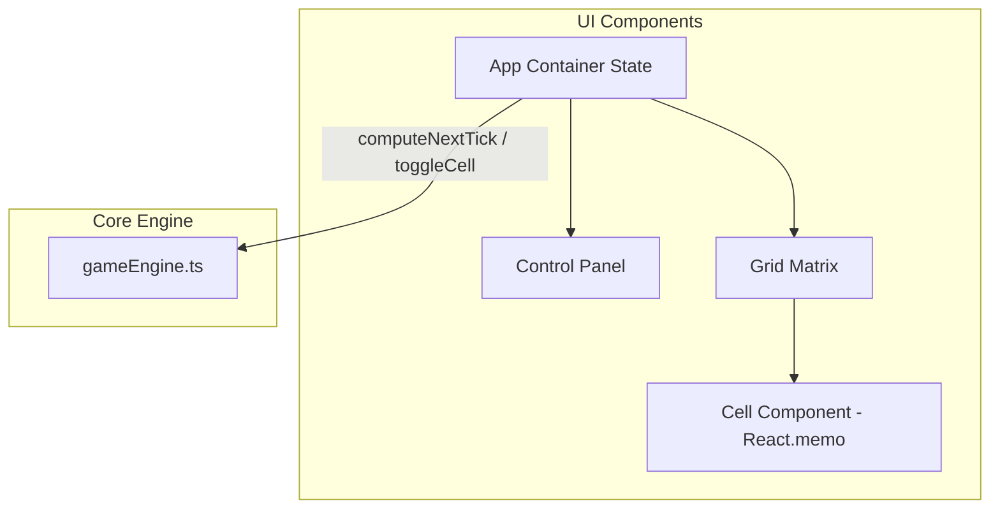

# 系統分析與設計書 (SA/SD)

## 專案名稱：康威生命遊戲 (Conway's Game of Life)

- **版本**：v1.0
- **狀態**：草稿
- **作者**：AI Agent (Antigravity) & User

---

## 1. 系統架構
本系統為單頁 Web 應用程式 (SPA)，架構拆分為：
1. **核心領域模型 (Domain/Core Engine)**：負責狀態運算，為純 TypeScript，與 UI 無關，便於單元測試。
2. **表現層 (UI/View Components)**：負責將資料渲染為網格與面板，處理使用者輸入與手勢，並執行 CSS 特效。



---

## 2. 核心資料結構與演算法

### 2.1 資料結構
- **網格狀態**：採用二維布林陣列 `boolean[][]`。`true` 代表存活，`false` 代表死亡。
- **維度**：固定為 `30` 列 (rows) x `30` 欄 (cols)。

### 2.2 鄰居計算與環面棋盤（Toroidal Matrix）
為了支援繞回 (Wrap-around) 特性，在尋找坐標 `(r, c)` 的 8 個鄰居時，當相對坐標偏移 `(i, j)` 超出邊界時，利用同餘運算 (Modulo) 將其重定向到對稱的另一側：

$$r_{neighbor} = (r + i + \text{rows}) \pmod{\text{rows}}$$
$$c_{neighbor} = (c + j + \text{cols}) \pmod{\text{cols}}$$

此計算邏輯封裝於 `gameEngine.ts`。

---

## 3. UI 元件設計

### 3.1 元件層級與職責
- **`App`**：
  - 管理全域狀態：`grid` (網格數據)、`running` (是否演化中)、`speed` (Tick 間隔 ms)。
  - 核心計時器：使用 `requestAnimationFrame` 或帶有 `useRef` 的 `setInterval` 來驅動演化循環，避免因 closure 綁定舊狀態。
- **`Grid`**：
  - 渲染細胞矩陣，使用 CSS Grid 排版：`grid-template-columns: repeat(30, 22px)`。
  - 監聽 `onMouseDown`、`onMouseUp` 與 `onMouseEnter` 組合事件，實作 Drag-to-Draw 拖曳畫圖。
- **`Cell`**：
  - **極致優化核心**：使用 `React.memo` 封裝，傳入 `isAlive` (布林值)、`row`、`col`，以及一個全域穩定的 `onToggle` 監聽器。
  - 當主 Grid 更新時，React 會對每個 Cell 進行 Shallow Compare。只有 `isAlive` 改變的細胞才會真正 Re-render 與重繪。
- **`ControlPanel`**：
  - 控制按鈕群、世代計數器與速度滑桿。

---

## 4. 效能優化設計 (DoD 量化設計)

### 4.1 React.memo 配合 useCallback
為避免 `onToggle` 函式在 `App` 每次重新渲染時生成新 reference，我們使用 `useCallback` 並透過 functional state update (`setGrid(prev => ...)`) 來保持該函式 reference 的絕對穩定，從而保證 `React.memo` 不會失效：

```typescript
const handleToggle = useCallback((r: number, c: number) => {
  setGrid(prev => toggleCell(prev, r, c));
}, []);
```

### 4.2 CSS 效能防護
- 避免在細胞狀態變更時修改會觸發瀏覽器 Layout/Reflow 的屬性（如 `width`、`height`、`margin`）。
- 使用 `transform: scale()`、`background-color` 與 `box-shadow` 這類可由 GPU 加速且只會觸發 Paint 或 Composite 的 CSS 屬性。
- 細胞生死轉移的動畫範例：
  ```css
  .cell {
    width: 20px;
    height: 20px;
    background-color: rgba(255, 255, 255, 0.03);
    border: 1px solid rgba(255, 255, 255, 0.05);
    transition: background-color 0.15s ease, transform 0.15s ease, box-shadow 0.15s ease;
    transform: scale(0.9);
  }
  .cell.alive {
    background-color: #10b981;
    background-image: linear-gradient(135deg, #10b981, #06b6d4);
    transform: scale(1);
    box-shadow: 0 0 6px rgba(6, 182, 212, 0.6);
  }
  ```

---

## 5. 測試計畫與 TDD 策略
`gameEngine.ts` 應為 Stateless 的純函數模組，包含：
- `createGrid(rows, cols, randomize, density)`：建立初始網格。
- `toggleCell(grid, r, c)`：切換單一細胞並回傳**全新 Grid 參照**（Immutable Update）。
- `computeNextTick(grid)`：根據康威規則計算並回傳下一世代的**全新 Grid 參照**。
- `countNeighbors(grid, r, c)`：計算周圍 8 個細胞的存活數。

我們將先撰寫 `gameEngine.test.ts` 測試上述函數的所有行為，然後才開始撰寫 `gameEngine.ts` 的實現。
